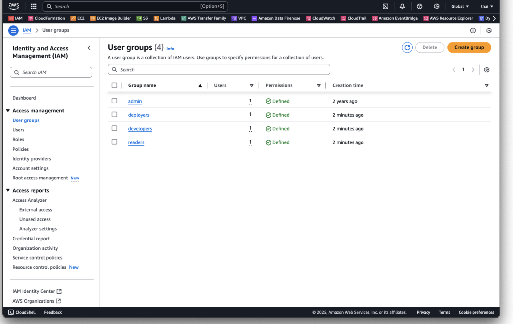
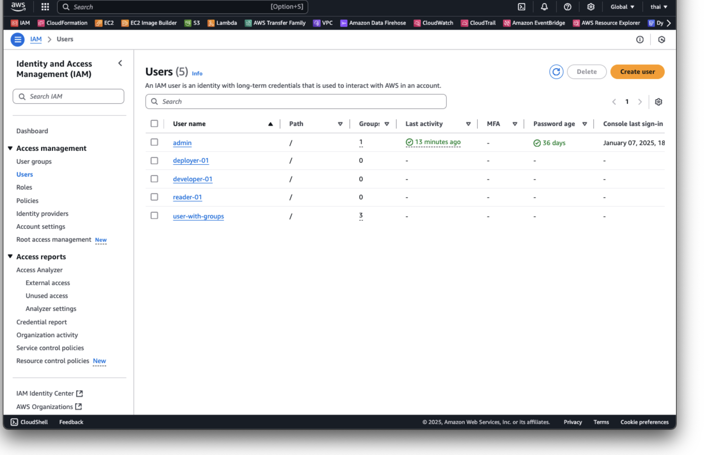
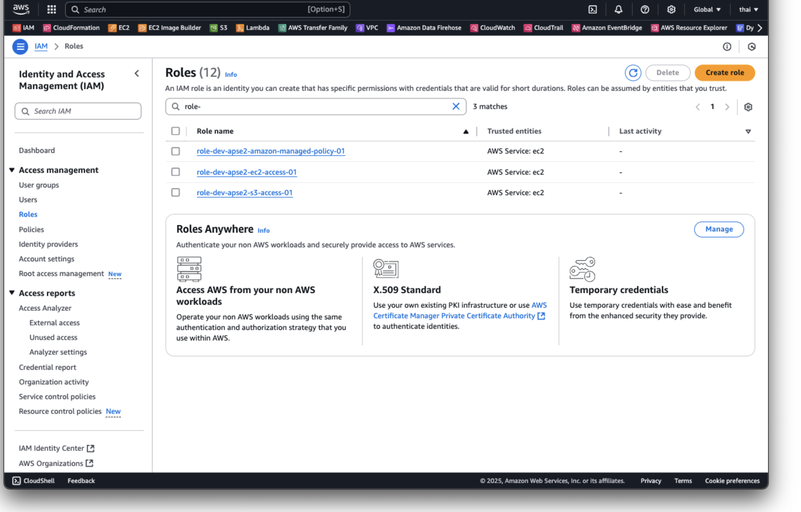
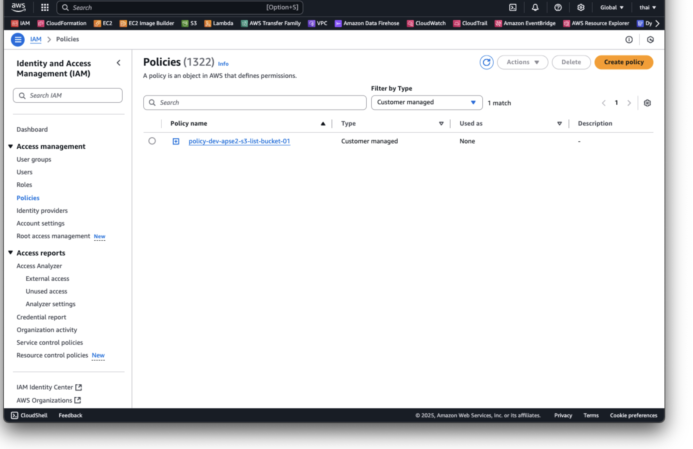

# Amazon Inspector

## Project Overview

This project focuses on mastering AWS Identity and Access Management (IAM) by provisioning and managing IAM resources. IAM is a critical AWS service for securely managing access to AWS services and resources. By implementing this project, the understanding of how to create and manage IAM users, groups, roles, and policies programmatically will be enhanced.

## Technologies Used

- **IAM:** Identity and Access Management for defining roles and permissions.
- **Terraform:** Infrastructure as Code (IaC) tool for automating resource provisioning.
- **Git:** For version control.

## Key Terms

- **IAM Users:** Individual accounts for accessing AWS services.
- **IAM Groups:** Collections of users with shared permissions.
- **IAM Roles:** Temporary credentials for users, applications, or services.
- **IAM Policies:** JSON documents defining access permissions.

## Key Concepts

**IAM Users:**

- Individual AWS accounts with access credentials (access key and secret key) for both programmatic access and management console login.
- Users are assigned to **groups**, or they may have **direct policies** attached to control their permissions.
- Users can also assume roles for temporary access to resources.

**IAM Groups:**

- Logical collections of IAM users that simplify permissions management.
- Permissions assigned to a group are inherited by all members, eliminating the need to attach policies directly to each user.
- A user can belong to **multiple groups**, inheriting permissions from all the groups they are a part of.

**IAM Roles:**

- AWS entities used to delegate permissions to **AWS services**, **external identities**, or even other **AWS accounts**.
- Roles are not tied to a specific user and do not have long-term credentials.
- Users can assume **multiple roles** to temporarily gain permissions they don’t usually have, but only one role can be assumed at a time per session.
- Example: A developer with restricted access may assume an admin role to perform privileged tasks temporarily.

**IAM Policies:**

- JSON-based documents that explicitly allow or deny actions on AWS resources.
- Policies define permissions in terms of **actions**, **resources**, and **conditions**.
- Can be attached to:
  - **Users** (directly).
  - **Groups** (applied to all members).
  - **Roles** (applied when the role is assumed).

## Requirements

- Terraform v1.5+
- AWS CLI
- AWS credentials configured.

## Usage

1. Clone this repository.

### Terraform

1. Edit `terraform.tfvars` with the desired AWS region and other variables.
2. Initialise Terraform:

   ```bash
   terraform init
3. terraform validate:

    ```bash
    terraform validate
    ```

4. Plan and apply the configuration:

    ```bash
    terraform plan
    terraform apply
    ```

### CloudFormation

1. Validate the CloudFormation template:

    ```bash
    
    aws cloudformation validate-template --template-body file://iam-group.yaml
    aws cloudformation validate-template --template-body file://iam-policy.yaml
    aws cloudformation validate-template --template-body file://iam-role.yaml
    aws cloudformation validate-template --template-body file://iam-user.yaml

    ```

2. Create the CloudFormation stack:

    ```bash
    
    aws cloudformation create-stack \
    --stack-name iam-group \
    --template-body file://iam-group.yaml \
    --parameters \
        ParameterKey=GroupNames,ParameterValue="developers\,deployers\,readers" \
    --capabilities CAPABILITY_NAMED_IAM CAPABILITY_AUTO_EXPAND \
    --region ap-southeast-2

    aws cloudformation create-stack \
    --stack-name iam-user \
    --template-body file://iam-user.yaml \
    --parameters \
        ParameterKey=UserNames,ParameterValue="developer-01\,deployer-01\,reader-01" \
        ParameterKey=Groups,ParameterValue="developers\,deployers\,readers" \
    --capabilities CAPABILITY_NAMED_IAM CAPABILITY_AUTO_EXPAND \
    --region ap-southeast-2

    aws cloudformation create-stack \
    --stack-name iam-role \
    --template-body file://iam-role.yaml \
    --capabilities CAPABILITY_NAMED_IAM CAPABILITY_AUTO_EXPAND \
    --region ap-southeast-2

    aws cloudformation create-stack \
    --stack-name iam-policy \
    --template-body file://iam-policy.yaml \
    --capabilities CAPABILITY_NAMED_IAM CAPABILITY_AUTO_EXPAND \
    --region ap-southeast-2

    ```

## Testing

| Step          | Command/Action | Expected Output  |
| ------------- | -------------- | -----------------|
| View IAM Groups | Navigate to IAM Console, Click on Groups | IAM groups should be listed |
| View IAM Users | Navigate to IAM Console, Click on Users | IAM users should be listed |
| View IAM Roles | Navigate to IAM Console, Click on Roles | IAM roles should be listed |
| View IAM Policies | Navigate to IAM Console, Click on Policies | IAM policies should be listed |

## Cleanup

### Terraform

1. Destroy resources

    ```bash
    terraform destroy
    ```

### CloudFormation

1. Destroy resources

    ```bash
    aws cloudformation delete-stack --stack-name iam-group
    aws cloudformation delete-stack --stack-name iam-user
    aws cloudformation delete-stack --stack-name iam-role
    aws cloudformation delete-stack --stack-name iam-policy
    ```

## Screenshots

### IAM Group

The following screenshot below shows the provisioned IAM groups:



### IAM User

The following screenshot below shows the provisioned IAM users:



### IAM Role

The following screenshot below shows the provisioned IAM roles:



### IAM Policy

The following screenshot below shows the provisioned IAM policies:


