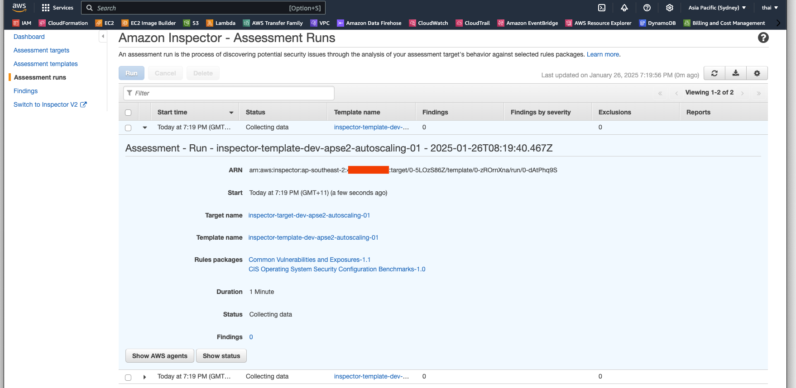
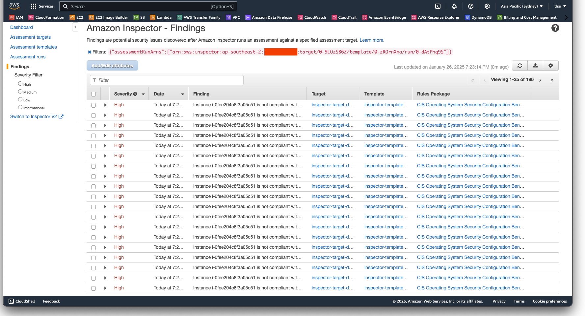

# Amazon Inspector

## Project Overview

This project demonstrates the use of both the Classic and v2 versions of AWS Inspector for assessments to deploy AWS Inspector to scan and assess vulnerabilities for both standalone EC2 instances and those deployed through an Auto Scaling Group (ASG). AWS Inspector is a security assessment service that helps identify vulnerabilities and deviations from security best practices.

## Technologies Used

- **AWS Inspector:** A service for automated security assessment of EC2 instances to identify vulnerabilities and improve security posture.
- **EC2:** Virtual machines for running applications.
- **Auto Scaling Group (ASG):** Automatically adjusts the number of EC2 instances based on demand.
- **IAM:** Identity and Access Management for defining roles and permissions.
- **Terraform:** Infrastructure as Code (IaC) tool for automating resource provisioning.
- **Git:** For version control.

## Key Terms

- **AWS Inspector:** A tool to identify vulnerabilities in EC2 instances.
- **Assessment Target:** A collection of resources to be assessed by AWS Inspector.
- **Assessment Template:** Defines the rules package and duration for assessments.
- **Auto Scaling Group:** A group of EC2 instances that scales based on demand.
- **IAM Role:** Provides permissions to AWS services like EC2 and Inspector.

## Key Concepts

- **Inspector Classic:** The original version of AWS Inspector, which requires the creation of assessment targets and templates. It supports a limited set of operating systems and regions. For more details of supported os, refer to the [Inspector Classic documentation](https://docs.aws.amazon.com/inspector/v1/userguide/inspector_supported_os_regions.html).

- **Inspector v2:** The newer version of AWS Inspector, which simplifies the setup process by eliminating the need for assessment targets. It provides broader coverage and improved integration with other AWS services.

- **Duration In Amazon Inspector**
  - In Inspector Classic, scans are ran on-demand or on a scheduled basis, and the duration of the scan (e.g., how long the assessment runs for) is specified.
  - In Inspector v2, there is no need to define a scan duration. Instead:
    - Scanning is continuous and automated.
    - Inspector v2 continuously monitors EC2 instances and container images for vulnerabilities or misconfigurations as soon as they are created or updated.

## Workflow

- AWS Inspector requires an **Assessment Target** to define the resources (e.g., EC2 instances) it will scan.
- An **Assessment Template** specifies the type of rules and duration for the scans.
- Auto Scaling Group instances must be dynamically included in the Inspector scans, which is managed using tags.

The following diagram represents the workflow of this project.


## Requirements

- Terraform v1.5+
- AWS CLI
- AWS credentials configured.

## Usage

1. Clone this repository.
2. Edit `terraform.tfvars` with the desired AWS region and other variables.
3. Comment out either the `inspector-classic` or `inspector-v2` module in root's `main.tf` based on the desired version of Inspector.
4. Initialise Terraform:

   ```bash
   terraform init
5. terraform validate:

    ```bash
    terraform validate
    ```

6. Plan and apply the configuration:

    ```bash
    terraform plan
    terraform apply
    ```

## Testing

### Amazon Inspector (Classic)

| Step          | Command/Action | Expected Output  |
| ------------- | -------------- | -----------------|
| Run Assessment    | `aws inspector start-assessment-run --assessment-template-arn <template-arn>` <br> or <br> Navigate to Inspector, Switch to Inspector Classic, Click on Assessment Runs, Click on Assessment template, select the desisred template and click on Run | Assessment run should start |
| View Assessment Run | `aws inspector list-assessment-runs` <br> or <br> Navigate to Inspector, Switch to Inspector Classic, Click on Assessment Runs | Assessment run should be listed |
| View Assessment Findings | `aws inspector list-findings --assessment-run-arn <assessment-run-arn>` <br> or <br> Navigate to Inspector, Switch to Inspector Classic, Click on Findings | Assessment findings should be listed |

### Amazon Inspector (v2)

| Step          | Command/Action | Expected Output  |
| ------------- | -------------- | -----------------|
| View Dashboard | Navigate to Inspector, Click on Dashboard | Inspector Dashboard should be displayed |
| View Resources coverage's EC2 Instances | Navigate to Inspector, Click on Resources coverage's EC2 Instances | EC2 instances should be listed |

## Cleanup

1. Stop Assessment Run

    ```bash
    aws inspector stop-assessment-run --assessment-run-arn <assessment-run-arn>
    ```

    or

    Navigate to Inspector, Switch to Inspector Classic, Click on Assessment Runs, Click on the assessment run, and click on Stop.

2. Destroy resources

    ```bash
    terraform destroy
    ```

## Screenshots

### EC2

The following screenshots below shows the provisioned EC2 instances


### Amazon Inspector (Classic)

The following screenshots below shows the provisioned Amazon Inspector (Classic).

**Amazon Inspector**


**Amazon Inspector Classic**


**Amazon Inspector Dashboard**


**Amazon Inspector (Classic) - Assessment Targets**


**Amazon Inspector (Classic) - Preview Targets**


**Amazon Inspector (Classic) - Assessment Templates**


**Amazon Inspector (Classic) - Run Assessment Templates**


**Amazon Inspector (Classic) - Running Assessment Templates**


**Amazon Inspector (Classic) - Completed Assessment Run**


**Amazon Inspector (Classic) - Assessment Findings**


### Amazon Inspector (v2)

The following screenshots below shows the provisioned Amazon Inspector (v2).

**Amazon Inspector (v2) - Dashboard**


**Amazon Inspector (v2) - Account Management**


**Amazon Inspector (v2) - Account Management - All EC2 Instances**


**Amazon Inspector (v2) - Account Management - Scanning EC2 Instances**

