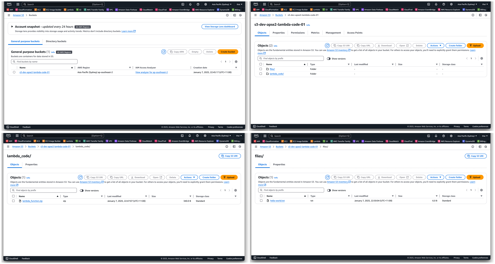
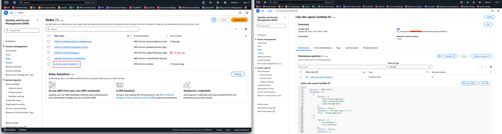
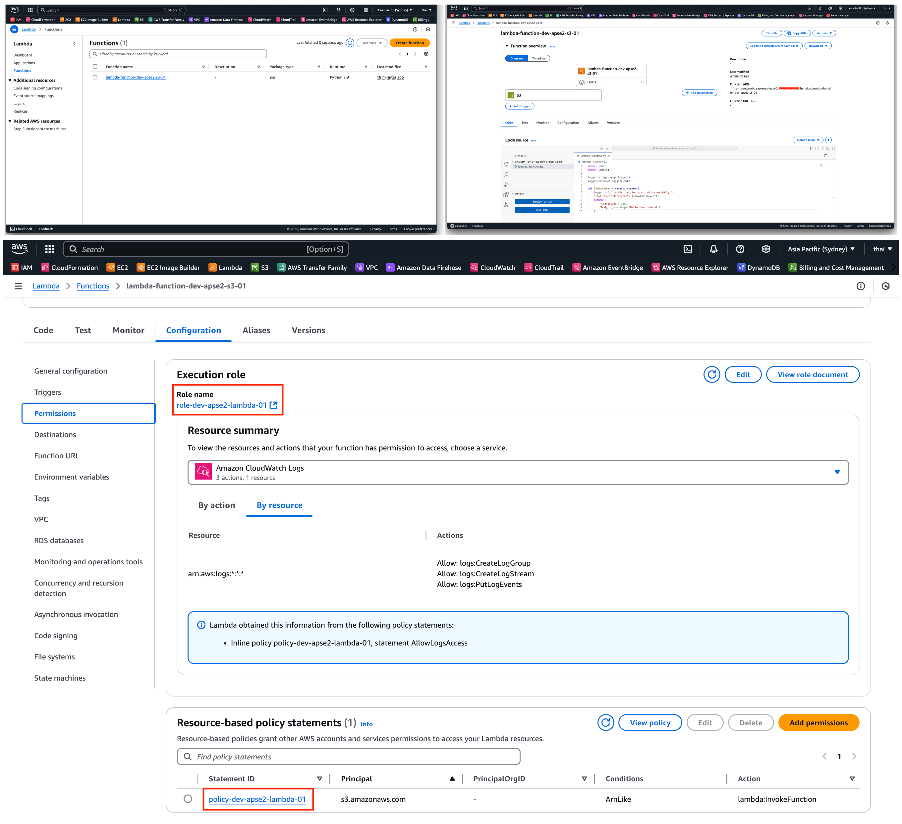
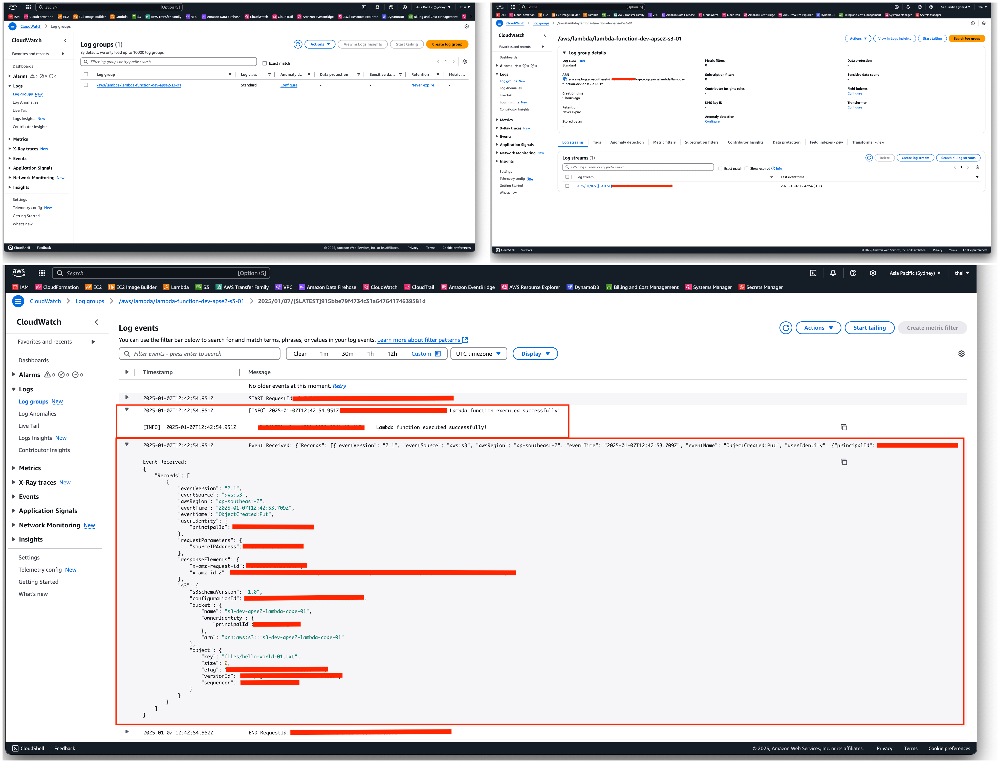

# AWS Logging and Lambda Automation with Terraform

## Project Overview

This project demonstrates an automated infrastructure deployment for AWS using Terraform modules. The setup includes:

1. Centralised Logging: Logging AWS Lambda function executions to CloudWatch Logs.
2. AWS Lambda Function: A Lambda function triggered by an S3 event, with its code stored in an S3 bucket.
3. Infrastructure-as-Code (IaC): Terraform modules to provision all required AWS resources.

## Status

This project is complete and successfully provisions Lambda automation with Terraform

## Technologies Used

- AWS: Cloud service provider.
  - S3: Object storage for Lambda code.
  - CloudWatch Logs: Centralized logging for AWS Lambda.
  - Lambda: Serverless compute service.
- Terraform: Infrastructure as Code (IaC) tool for AWS resource provisioning.
  - Modules: Reusable Terraform configurations.

## Background

### AWS Lambda

AWS Lambda is a serverless compute service that runs code in response to events. It scales automatically and charges only for compute time used. In this project, the Lambda function is triggered by S3 bucket events (e.g., object creation).

### CloudWatch Logs

Amazon CloudWatch Logs enable monitoring and storing of log data from AWS services. Here, it captures Lambda execution logs.

### S3

Amazon S3 provides scalable object storage. The Lambda function code is uploaded to an S3 bucket and fetched during deployment.

### Terraform

Terraform is an open-source IaC tool that allows users to define and provision infrastructure in a declarative configuration language. By using modules, Terraform configurations become reusable and maintainable.

## Project Features

- Event-driven Lambda: A Lambda function triggered by S3 object events.
- Centralised Logging: Logging Lambda execution details to CloudWatch Logs.
- Terraform Modules: Separate modules for Lambda, S3, and IAM.
- Secure Infrastructure: IAM roles and policies for Lambda execution permissions.

## Requirements

- Terraform v1.5+
- AWS CLI
- AWS credentials configured.

## Workflow

1. S3 Bucket Creation: Terraform provisions an S3 bucket to store Lambda function code.
2. IAM Role and Policy: IAM module creates a role for the Lambda function, granting it permissions for S3 and CloudWatch.
3. Lambda Deployment: Terraform deploys the Lambda function using the code uploaded to the S3 bucket.
4. Event Trigger: An S3 bucket event triggers the Lambda function on object creation.
5. Logging: The Lambda function writes logs to CloudWatch Logs.

## Usage & Testing

| Step          | Command/Action | Expected Output  |
| ------------- | -------------- | -----------------|
| Clone this repository        | Follow Github's cloning instructions | Cloned repository into local machine.
| Edit `terraform.tfvars` | Open terraform.tfvars and adjust accordingly <pre> 
 cd ... 
</pre>          | Configured values.
| Change directory        | From terminal, change directory to the `terraform` folder | Directory changed.
| Initialise Terraform        | Run the following in terminal: <pre> 
terraform init  
</pre>              | Initialised Terraform configurations.
| Validate Terraform        | Run the following in terminal: <pre> 
terraform validate  
</pre>              | Validated Terraform configurations.
| Deploy S3 Bucket         | Run the following in terminal: <pre> 
terraform apply -target=module.s3  
</pre>              | Deployed S3 Bucket.
| Package Lambda Code        | Run the following in terminal: <pre> 
zip lambda_function.zip lambda_function.py  
</pre>              | A `.zip` file is created in `lambda_code/`.
| Upload Lambda Code to S3         | Run the following in terminal: <pre> 
aws s3 cp ../src/lambda_code/lambda_function.zip s3://s3-dev-apse2-lambda-code-01/lambda_code/
</pre>       |   File is uploaded successfully to S3.
| Deploy remaining resources (IAM and Lambda) | Run the following in terminal: <pre> 
terraform plan terraform apply 
</pre> | Plan and Applied Terraform configurations.
| Trigger Lambda by Uploading File      | Run the following in terminal: <pre> 
aws s3 cp ../src/test-data/hello-world-01.txt s3://s3-dev-apse2-lambda-code-01/files/  
</pre>    |   Lambda is triggered by the new file upload. Note it may take a few minutes for CloudWatch to be ready if no logs are registered immediately wait a few minutes for uploading a test file
| Check Logs in CloudWatch      | <pr>
 <ol> <li> Log into AWS and navigate to CloudWatch.<li> Select Log groups.</li> <li>Find and select Log Group `/aws/lambda/lambda-function-dev-apse2-s3-01`</li> <li>View logs in CloudWatch Logs.</li></ol></pre> |   Logs show the S3 event processed by Lambda.
| Clean Up        | Run the following in terminal: <pre> 
terraform destroy
</pre>  | Resources deleted.

## Screenshots

### S3 Bucket

This screenshot shows the provisioned S3 Bucket and its objects:

### IAM Role

This screenshot shows the provisioned IAM role and policy.

### Lambda

This screenshot shows the provisioned Lambda code and its assigned role and permissions.

### CloudWatch

This screenshot shows CloudwWatch and the logged event triggered by uploading a file to the S3 bucket.

