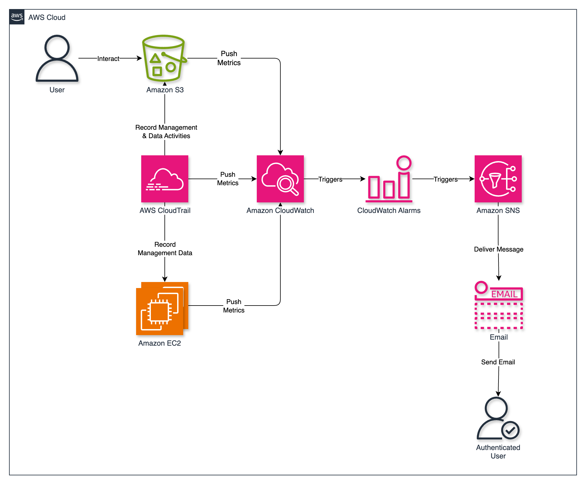
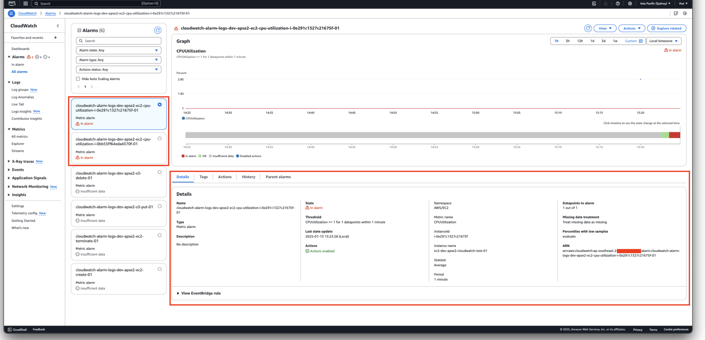
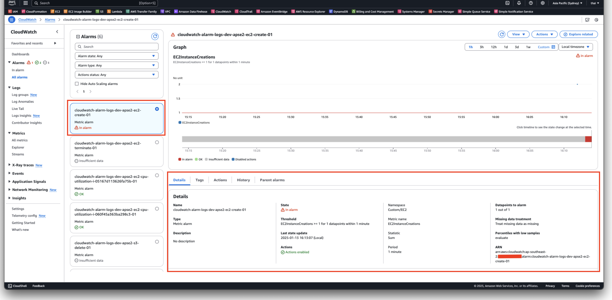

# AWS Notification and Message Queue System

## Project Overview

This project sets up comprehensive logging and monitoring for AWS resources. It includes CloudTrail for tracking API activities and CloudWatch for performance metrics and event monitoring. Alerts are sent via Amazon SNS when alarms are triggered, ensuring real-time notifications for critical events. All resources are provisioned using Terraform modules to promote reusability, maintainability, and modularity.

## Technologies Used

- **Amazon S3:** Scalable object storage service used to store processed data.
- **AWS CloudTrail:** Tracks user activity and API requests for auditing purposes.
- **AWS CloudWatch:** Collects monitoring and operational data, enabling log storage and metric analysis.
- **AWS SNS:** A messaging service for sending notifications.
- **Terraform:** Infrastructure as Code (IaC) tool for automating resource provisioning.
- **Git:** For version control.

## Key Terms

- **API Activity**: Any interaction with AWS services, such as creating resources or retrieving data, typically recorded by CloudTrail for security and auditing purposes.
- **Management Events:** API calls that manage AWS resources, such as creating, deleting, or modifying them. Examples include CreateBucket or TerminateInstances.
- **Data Events:** API calls that interact with the data within AWS resources, such as uploading or retrieving an object in an S3 bucket (PutObject, GetObject).
- **Metrics:** Data points collected by CloudWatch that represent resource performance (e.g., CPU utilization for EC2 instances or request counts for S3).

## Key Concepts

### Amazon S3

- Amazon Simple Storage Service (S3) is an object storage service designed to store and retrieve any amount of data.
- S3 can generate request metrics for operations like PutObject, GetObject, and DeleteObject, which are published to CloudWatch when enabled.
- These metrics can be scoped to monitor specific prefixes, tags, or the entire bucket, making it a valuable tool for tracking object-level activities and triggering alerts.

### CloudTrail

- AWS CloudTrail provides a detailed record of API calls made to AWS services, helping with auditing, compliance, and troubleshooting.
- It captures both management events (e.g., creating and deleting resources) and data events (e.g., accessing S3 objects or invoking Lambda functions).
- CloudTrail logs can be stored in an S3 bucket for long-term retention and compliance or sent to CloudWatch for real-time processing.
- **Event History**: Allows you to view, search, and download the past 90 days of recorded API activity in your AWS account.
- **CloudTrail's Trail**: Enables continuous delivery of CloudTrail events to an S3 bucket, CloudWatch Logs, or CloudWatch Events for long-term retention and analysis.

### When to Use CloudTrail Event History vs. CloudTrail Trails

- Use Event History:
  - For short-term investigation (e.g., troubleshooting something that happened recently).
  - To quickly verify API activity without additional setup.
- Use a Trail:
  - For compliance or audit requirements that need longer-term retention or deeper logging.
  - When monitoring data events (e.g., S3 object actions or Lambda invocations).
  - For real-time monitoring and alerts with CloudWatch.
  - To log activity across multiple accounts using AWS Organizations.

### Amazon CloudWatch

- A monitoring and observability service that collects metrics, logs, and events from AWS services and applications.
- It includes predefined metrics (e.g., CPUUtilization for EC2) and supports custom metrics derived from log files using log metric filters.
- CloudWatch enables the creation of alarms that trigger when specific thresholds are crossed, supporting automation and proactive management.

### CloudWatch Log Groups

- Log groups are containers for logs ingested into CloudWatch, such as CloudTrail logs or application logs.
- These logs can be processed using metric filters to extract meaningful patterns and create custom metrics for advanced monitoring.

### Log Metric Filters

- Metric filters process log data in real-time to identify patterns or events (e.g., RunInstances, TerminateInstances) and increment custom metrics.
- These metrics enable monitoring and alerting for specific actions or behaviors not covered by predefined metrics.

### CloudWatch Alarms

- Alarms evaluate metrics and trigger actions when thresholds are breached, such as sending notifications or invoking Lambda functions.
- Alarms can monitor both predefined metrics (e.g., S3 request metrics, EC2 CPU usage) and custom metrics created from log filters.

### Amazon SNS (Simple Notification Service)

- SNS is a messaging service that enables notifications to be sent to subscribers, such as email or SMS recipients.
- In this project, SNS is used to send email alerts when CloudWatch alarms are triggered, providing real-time notifications for critical events.

## Workflow

### CloudTrail Captures Events

- Events are logged and stored in an S3 bucket for long-term retention and compliance.
- CloudTrail also sends the logs to a CloudWatch Log Group for real-time processing and monitoring.

### S3 Bucket Monitoring for Object Operations

- An S3 bucket is configured to enable request metrics using an EntireBucket filter, which captures all object-level operations (e.g., PutObject and DeleteObject) for monitoring.
- These metrics (PutRequests, DeleteRequests) are sent to CloudWatch under the AWS/S3 namespace.
- A CloudWatch Alarm is created to monitor the DeleteRequests metric. If one or more objects are deleted within a defined period (e.g., 5 minutes), an alarm is triggered, and a notification is sent via SNS.
Similarly, a separate alarm monitors the PutRequests metric to detect object uploads in the bucket.

### CloudWatch Processes Metrics

- For predefined metrics (e.g., CPUUtilization for EC2 or DeleteRequests for S3), CloudWatch automatically collects and aggregates the data at 1-minute or 5-minute intervals, depending on the monitoring level.

### CloudWatch Alarms Monitor Metrics

- Alarms are set up to monitor predefined metrics, such as CPUUtilization or DeleteRequests.
- Alarms also monitor custom metrics derived from log filters (e.g., EC2 instance creation or termination events).
- When a metric crosses its threshold (e.g., More than 1 object is deleted from an S3 bucket, CPU usage exceeds 80% or an EC2 instance is created), the alarm transitions to the ALARM state.

### SNS Sends Notifications

- Each alarm is configured to send notifications via an Amazon SNS topic.
- The SNS topic sends an email alert to subscribed recipients (e.g., administrators or engineers).
- Recipients can take immediate action based on the notification, such as investigating high CPU usage or verifying unauthorized EC2 instance creation.

The following diagram represents the workflow of this project.



## Requirements

- Terraform v1.5+
- AWS CLI
- AWS credentials configured.

## Usage

1. Clone this repository.
2. Edit `terraform.tfvars` with the desired AWS region and other variables.
3. Initialise Terraform:

   ```bash
   terraform init
4. terraform validate:

    ```bash
    terraform validate
    ```

5. Plan and apply the configuration:

    ```bash
    terraform plan
    terraform apply
    ```

## Testing

| Step          | Command/Action | Expected Output  |
| ------------- | -------------- | -----------------|
| Confirm email subscription    | Once resources are deployed, confirm the subscription via the email link.  | Email subscription is active.
| Confirm deployed `s3-dev-apse2-cloudtrail-01` S3 Bucket | Run the following in the terminal: <pre> <p>aws s3 ls</p></pre>              | `s3-dev-apse2-cloudtrail-01` S3 Bucket has been deployed.
| Confirm deployed `cloudwatch-alarm-test` S3 Bucket | Run the following in the terminal: <pre> <p>aws s3 ls</p></pre>              | `cloudwatch-alarm-test` S3 Bucket has been deployed.
| Confirm deployed `cloudtrail-logs-dev-apse2-01` Cloudtrail | 1. In console, navigate to the CloudTrail <br>2. Select Trails and select `cloudtrail-logs-dev-apse2-01`              | `cloudtrail-logs-dev-apse2-01` trail has been deployed.
| Verify `cloudtrail-logs-dev-apse2-01` configuration | Refer to Cloudtrail screenshot              | All `cloudtrail-logs-dev-apse2-01` configurations have been deployed.
| Upload files to `cloudwatch-alarm-test` S3 Bucket  | Run the following in the terminal: <pre> <p>aws s3 cp ../src/test-data/hello-world-01.txt s3://s3-dev-apse2-cloudwatch-alarm-test-01<br>aws s3 cp ../src/test-data/hello-world-02.txt s3://s3-dev-apse2-cloudwatch-alarm-test-01<br>aws s3 cp ../src/test-data/hello-world-03.txt s3://s3-dev-apse2-cloudwatch-alarm-test-01<br>aws s3 cp ../src/test-data/hello-world-04.txt s3://s3-dev-apse2-cloudwatch-alarm-test-01<br>aws s3 cp ../src/test-data/hello-world-05.txt s3://s3-dev-apse2-cloudwatch-alarm-test-01 </p></pre>              | Files are uploaded to `cloudwatch-alarm-test` S3 Bucket.
| Delete files from `cloudwatch-alarm-test` S3 Bucket | Run the following in the terminal: <pre> <p>aws s3 rm s3://s3-dev-apse2-cloudwatch-alarm-test-01/hello-world-01.txt<br>aws s3 rm s3://s3-dev-apse2-cloudwatch-alarm-test-01/hello-world-02.txt<br>aws s3 rm s3://s3-dev-apse2-cloudwatch-alarm-test-01/hello-world-03.txt<br>aws s3 rm s3://s3-dev-apse2-cloudwatch-alarm-test-01/hello-world-04.txt<br>aws s3 rm s3://s3-dev-apse2-cloudwatch-alarm-test-01/hello-world-05.txt</p></pre>              | Files are deleted from `cloudwatch-alarm-test` S3 Bucket.
| Run EC2 Instances | Run the following in the terminal: <pre><code>aws ec2 run-instances \ <br>--image-id ami-xxx \ <br>--count 2 \ <br>--instance-type t2.micro \ <br>--key-name my-key-pair \ <br>--security-group-ids sg-xxx \ <br>--subnet-id subnet-xxx \</p></pre>              | EC2s are running.
| Terminate EC2 Instances | Run the following in the terminal: <pre> <p>aws ec2 terminate-instances --instance-ids <instance-id> <instance-id></p></pre>              | EC2s are terminated.
| Verify `cloudwatch-alarm-test` S3 Bucket's Filter and Metrics| 1. In console, navigate to the S3 bucket `s3-dev-apse2-cloudwatch-alarm-test-01`.              | The S3 Bucket has been deployed. View metrics, additional charts, and request metrics. Note that the metrics can take a few minutes to register. | The entire bucket is present in Filters, and metrics data are displayed in the graph.
| Verify Cloudwatch Alarms    | 1. In the console, navigate to Cloudwatch.<br>2. Select All Alarms<br>3. Verify Cloudwatch alarms are present.  | The following alarms are present: <br>`cloudwatch-alarm-logs-dev-apse2-s3-put-01`<br>`cloudwatch-alarm-logs-dev-apse2-s3-delete-01`<br>`cloudwatch-alarm-logs-dev-apse2-ec2-create-01`<br>`cloudwatch-alarm-logs-dev-apse2-ec2-terminate-01`<br>`cloudwatch-alarm-logs-dev-apse2-ec2-cpu-utilization`
| Verify Cloudwatch Alarms Configuration     | 1. In the console, navigate to Cloudwatch.<br>2. Select All Alarms.<br>3. Select an alarm.<br>4. Verify details (for further comparison, refer to the Cloudwatch screenshot).  | All details are present.
| Verify Cloudwatch state `Alarms`    | 1. In the console, navigate to Cloudwatch.<br>2. Select All Alarms<br>3. Verify Cloudwatch alarms are present.  | Each Alarm entered the `Alarm` state after a few minutes after executing the previous commands. For further reference, please review screenshots:
| Verify SNS Alert (Email)    | Verify email subscription.  | An email notification is sent when the alarm triggers.
| Verify `cloudtrail-logs-dev-apse2-01` logs (S3 Bucket)   | Run the following in the terminal: <pre> <p>aws s3 ls s3-dev-apse2-cloudtrail-01 --recursive</p></pre>   | Logs are be present.
| (Optional) Trigger Alarm to `ALERT` state | Run the following in the terminal:<pre> <p>aws cloudwatch set-alarm-state --alarm-name cloudwatch-alarm-logs-dev-apse2-cloudtrail-01 --state-reason "Testing the Amazon Cloudwatch alarm" --state-value ALARM</p></pre> | Alarm's state is updated to ALARM state |
| Verify `cloudwatch-logs-dev-apse2-cloudtrail-01` log group   |   1. In the console, navigate to CloudWatch.<br>2. Select Log groups<br>3. Select `cloudwatch-logs-dev-apse2-cloudtrail-01`.     | Log group and logs are be present.

## Cleanup

1. Empty S3 Buckets
    1. Navigate to S3 Bucket
    2. Select S3 buckets
    3. Empty Bucket

2. Destroy resources

    ```bash
    terraform destroy
    ```

## Screenshots

### Amazon S3

The following screenshots below shows the provisioned S3 Buckets


### AWS CloudTrail

The following screenshot below shows the provisioned CloudTrail


### EC2

The following screenshots below shows the provisioned EC2s


### Amazon Cloudwatch

The following screenshots below shows the provisioned CloudWatch Alarms and Log Group








### Amazon SNS

The following screenshots below shows the provisioned SNS


