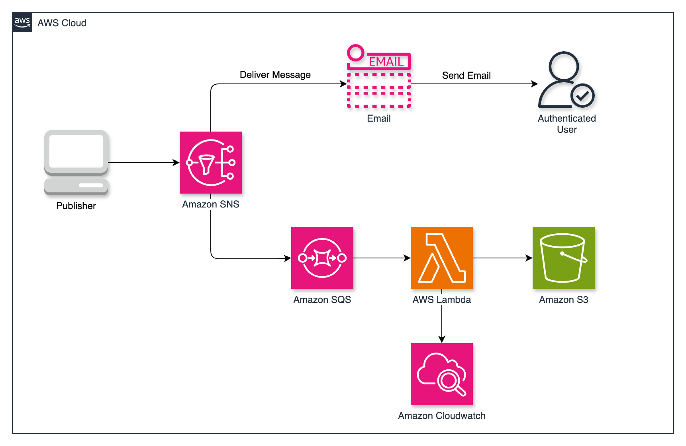
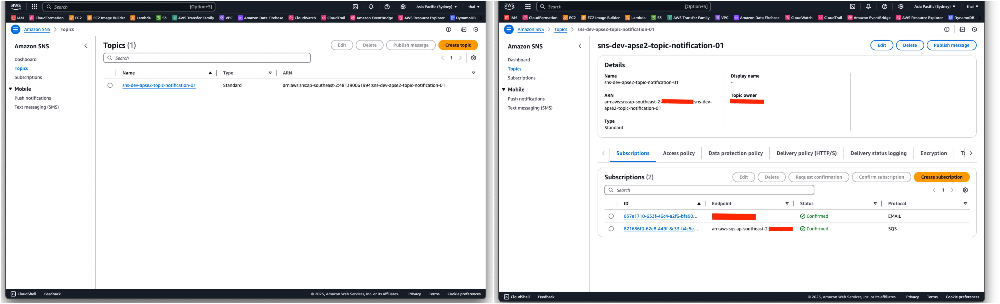
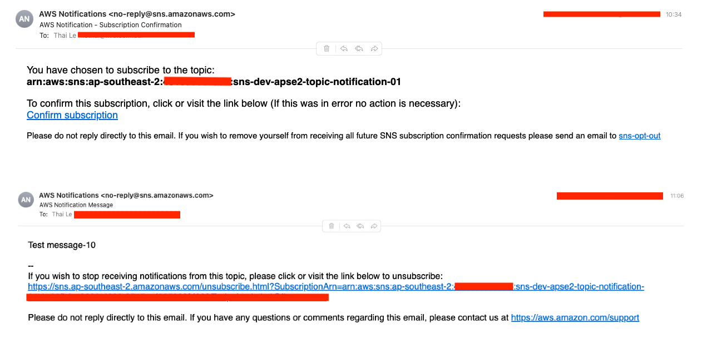
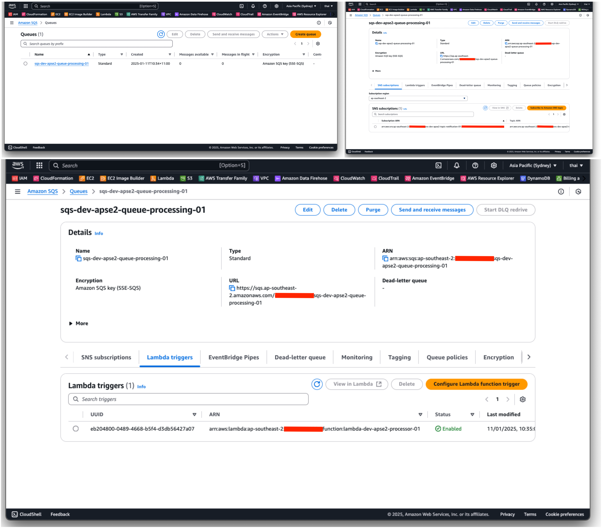
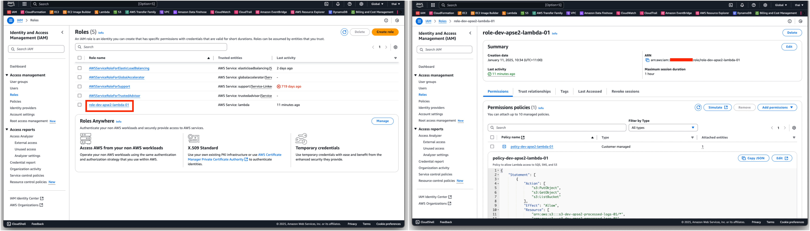
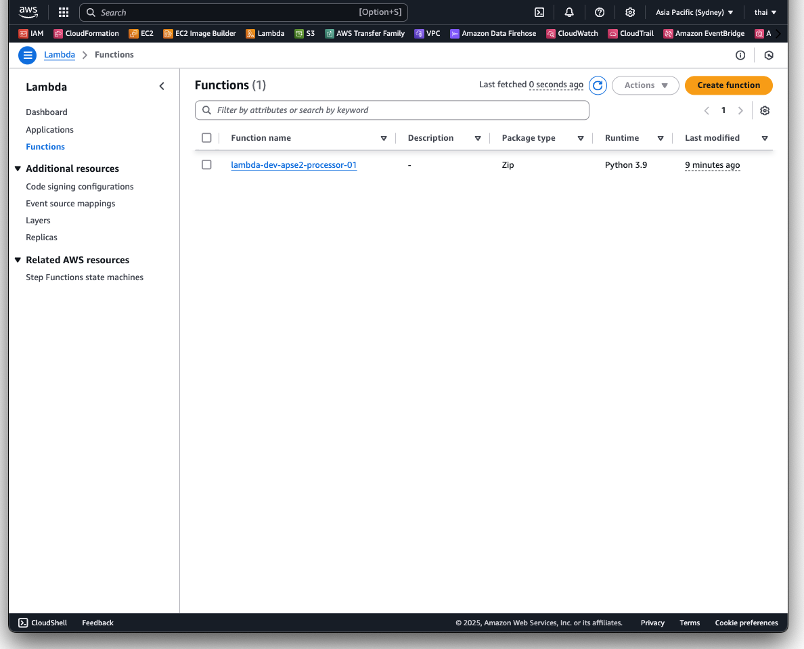
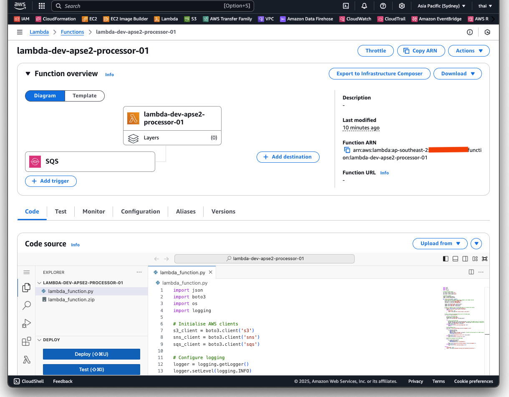
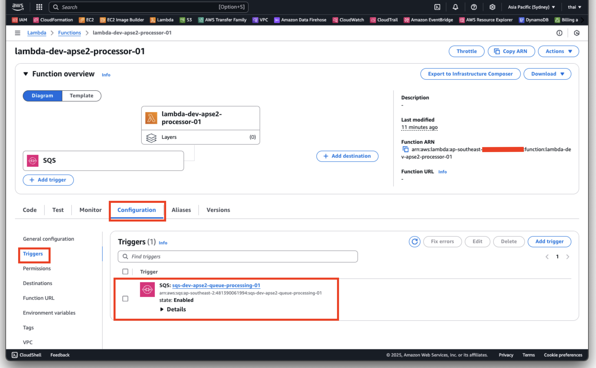
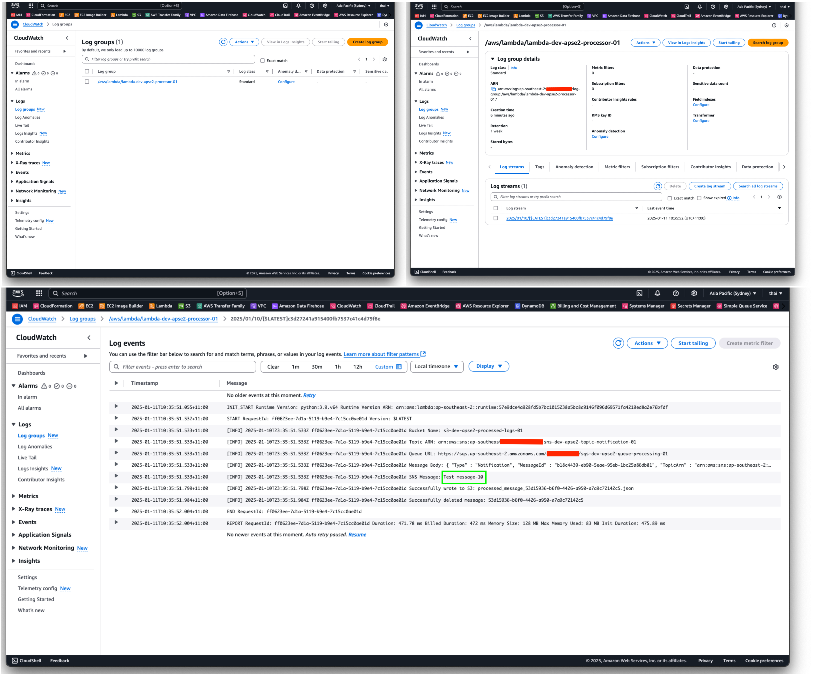
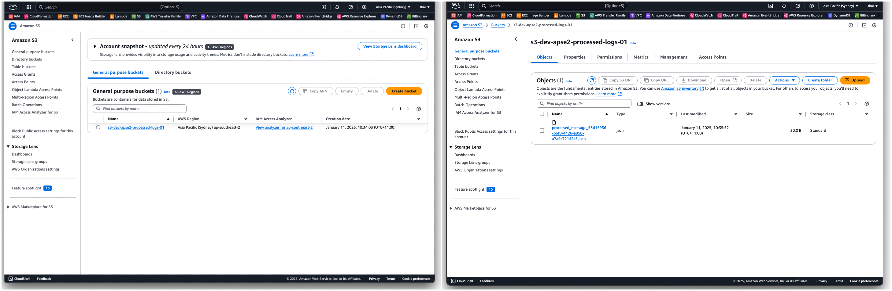

# AWS Notification and Message Queue System

## Project Overview

This project demonstrates the creation of a scalable and efficient notification and messaging system using AWS services such as Simple Notification Service (SNS) and Simple Queue Service (SQS). All resources are provisioned using Terraform modules to promote reusability, maintainability, and modularity.

## Technologies Used

- **AWS SNS:** A messaging service for sending notifications to multiple subscribers via a push-based model.
- **AWS SQS:** A message queuing service for decoupling producers and consumers using a poll-based model.
- **AWS Lambda:** A serverless compute service that processes messages and integrates with other AWS services.
- **AWS S3:** A scalable object storage service used to store processed data.
- **Terraform:** Infrastructure as Code (IaC) tool for automating resource provisioning.
- **Git:** For version control of Terraform configurations.

## Project Features

- **Modular Design:** Terraform modules promote reusability and scalability.
- **SNS Topic and SQS Queues:** Enable reliable message dissemination and decoupled processing.
- **Lambda Integration:** Efficiently processes messages from SQS and stores results in an S3 bucket.
- **S3 Storage:** Durable and scalable storage for processed messages.

## Workflow

1. **Message Source:** Messages originate from publishers or the AWS CLI and are sent to the SNS topic.
2. **SNS Topic:** Acts as a hub, distributing messages to the SQS queue.
3. **SQS Queue:** Buffers messages for reliable consumption by the Lambda function.
4. **Lambda:** Processes the messages, performs any necessary transformations, and stores the results in the S3 bucket.
5. **S3 Bucket:** Serves as durable storage for processed messages.

The following diagram represents the workflow of this project.



## Key Terms

- **Publishers**: Entities or applications that send messages to the SNS topic. Examples include CLI commands or applications generating events.
- **Subscribers**: Endpoints that receive messages from the SNS topic. Examples include SQS queues (for processing) and email addresses (for notifications).
- **SNS Topics**: Central hubs for message distribution. Publishers send messages to the topic, which then delivers them to all active subscribers.
- **Messages**: Data sent by publishers to subscribers. These messages may include attributes for further filtering or processing.
- **Push vs. Poll**:
  - **Push**: SNS sends messages directly to subscribers like email or webhooks.
  - **Poll**: SQS stores messages until a consumer, like Lambda, retrieves them for processing.

## Key Concepts

### Terraform

Terraform is an open-source IaC tool that allows users to define and provision infrastructure in a declarative configuration language. By using modules, Terraform configurations become reusable and maintainable.

### What is AWS Lambda?

AWS Lambda is a serverless compute service that runs code in response to events. It eliminates the need to manage infrastructure, allowing developers to focus on writing code.

### What is Amazon S3?

Amazon S3 is an object storage service that offers industry-leading scalability, data availability, and security. In this project, it is used to store processed messages for durable storage.

### What is SNS?

Amazon Simple Notification Service (SNS) is a fully managed publish/subscribe messaging service. Publishers send messages to **SNS Topics**, and subscribers (e.g., email endpoints or other AWS services) receive notifications. SNS uses a **push-based model**, meaning subscribers are notified as soon as a message is published.

**How it works:**

1. Publishers send messages to an SNS Topic.
2. Subscribers (e.g., SQS, Lambda, Email) receive notifications via the specified protocol.
3. Supports filtering, which allows certain subscribers to receive only relevant messages.

### What is SQS?

Amazon Simple Queue Service (SQS) is a fully managed message queuing service designed to decouple producers and consumers. It uses a **poll-based model**, where consumers periodically poll the queue for new messages.

**How it works**

1. Messages are sent to a queue.
2. Consumers poll the queue to process messages.
3. Dead-letter queues handle messages that cannot be processed successfully. When a process requests a message, it is locked, not deleted, ensuring failed processes allow the message to be reprocessed after the lock expires. In SQS, this is managed via Queue Retry, which controls retries before moving the message to a Dead Letter Queue (DLQ).

### Why Use SNS and SQS Together?

Combining SNS and SQS provides a powerful, decoupled architecture:

1. SNS broadcasts messages to multiple subscribers (e.g., SQS queues).
2. SQS ensures reliable message processing by decoupling message delivery and consumption.
3. Together, they provide scalability, reliability, and fault-tolerance.

### Queue Message

When a message is sent to an Amazon SQS (Simple Queue Service) queue, it is stored as a JSON object. The structure of this JSON object contains several key pieces of information about the message. Below is an example of how a queue message is structured:

```json
{
    "Records": [
        {
            "messageId": "059f36b4-87a3-44ab-83d2-661975830a7d",
            "receiptHandle": "AQEBwJnKyrHigUMZj6rYigCgxlaS3SLy0a...",
            "body": "Test message.",
            "attributes": {
                "ApproximateReceiveCount": "1",
                "SentTimestamp": "1545082649183",
                "SenderId": "AIDAIENQZJOLO23YVJ4VO",
                "ApproximateFirstReceiveTimestamp": "1545082649185"
            },
            "messageAttributes": {
                "myAttribute": {
                    "stringValue": "myValue", 
                    "stringListValues": [], 
                    "binaryListValues": [], 
                    "dataType": 'String'
                }
            },
            "md5OfBody": "e4e68fb7bd0e697a0ae8f1bb342846b3",
            "eventSource": "aws:sqs",
            "eventSourceARN": "arn:aws:sqs:us-east-2:123456789012:my-queue",
            "awsRegion": "us-east-2"
        },
        {
            "messageId": "2e1424d4-f796-459a-8184-9c92662be6da",
            "receiptHandle": "AQEBzWwaftRI0KuVm4tP+/7q1rGgNqicHq...",
            "body": "Test message.",
            "attributes": {
                "ApproximateReceiveCount": "1",
                "SentTimestamp": "1545082650636",
                "SenderId": "AIDAIENQZJOLO23YVJ4VO",
                "ApproximateFirstReceiveTimestamp": "1545082650649"
            },
            "messageAttributes": {},
            "md5OfBody": "e4e68fb7bd0e697a0ae8f1bb342846b3",
            "eventSource": "aws:sqs",
            "eventSourceARN": "arn:aws:sqs:us-east-2:123456789012:my-queue",
            "awsRegion": "us-east-2"
        }
    ]
}
```

When a message is sent to an SQS queue, it is stored with the above structure. When the Lambda function processes the event, it extracts the body field from each record in the Records list. The body field contains the actual content of the message, which can then be parsed and processed further. This can be seen in `lambda_function.py` file. The above example JSON structure is sourced from the [Using Lambda with Amazon SQS](https://docs.aws.amazon.com/lambda/latest/dg/with-sqs.html) documentation. For further explanation please consider visiting the link.

## Requirements

- Terraform v1.5+
- AWS CLI
- AWS credentials configured.

## Usage

1. Clone this repository.
2. Edit `terraform.tfvars` with the desired AWS region and other variables.
3. Initialise Terraform:

   ```bash
   terraform init
4. terraform validate:

    ```bash
    terraform validate
    ```

5. Plan and apply the configuration:

    ```bash
    terraform plan
    terraform apply
    ```

## Testing

| Step          | Command/Action | Expected Output  |
| ------------- | -------------- | -----------------|
| Confirm email subscription    | Once resources are deployed, confirm subscription via email link.  | Email subscription is active.
| Publish a test message        | Run the following in terminal: <pre> <p>aws sns publish --topic-arn <SNS_TOPIC_ARN> --message "Test Message" </p></pre>              | Message ID is returned.
| Verify Lambda processing         | Run the following in terminal: <pre> <p>Check AWS CloudWatch Logs. </p></pre>              | Logs show message processed and forwarded to S3.
| Verify S3 bucket         | Run the following in terminal: <pre> <p> aws s3 ls s3://<S3_BUCKET_NAME>/ </p></pre>              | Processed message file is present in the S3 bucket.
| Verify email notification          | Run the following in terminal: <pre> <p> Check the subscribed email.  </p></pre>              | Email with "Message Processed" and message content is received.

## Cleanup

Destroy resources

  ```bash
  terraform destroy
  ```

## Screenshots

### SNS

The following screenshots shows the provisioned SNS and its topics and subscriptions



### Email

The following screenshots shows the confirmation email and received message.



### SQS

The following screenshots shows the provisioned SQS and its queues



### IAM Role

The following screenshots shows the provisioned IAM role and policy.



### Lambda

The following screenshots shows the provisioned Lambda code and its assigned role and permissions.






### CloudWatch

The following screenshots shows CloudwWatch and the logged event triggered by uploading a file to the S3 bucket.



### S3 Bucket

The following screenshots shows the provisioned S3 Bucket and its objects.

