# Amazon Inspector

## Project Overview

This project implements a real-time serverless data pipeline to process IoT sensor data efficiently. IoT devices publish sensor data to AWS IoT Core, which routes it to Kinesis Data Streams. AWS Lambda processes and transforms this data before storing it in DynamoDB for real-time querying. For deeper analytics, AWS Glue extracts, transforms, and loads (ETL) data into Amazon Redshift.

## Workflow

1. **IoT Devices Send Data:** IoT devices publish real-time sensor data (e.g., temperature, humidity) to AWS IoT Core.
2. **AWS IoT Core Routes Data to Kinesis:** IoT Core rules forward data to Amazon Kinesis Data Streams for real-time ingestion
3. **Kinesis Streams Process Data:** AWS Kinesis holds the incoming data stream, ensuring scalability and real-time processing. It also, triggers Lambda functions to process the data.
4. **AWS Lambda Transforms Data:** A Lambda function fetches data from Kinesis, processes it and stores it in DynamoDB.
5. **AWS DynamoDB Stores Data:** The transformed IoT data is stored in a DynamoDB table for real-time querying.
6. **AWS Glue Performs ETL to Amazon Redshift:** AWS Glue extracts data from DynamoDB, transforms it, and loads it into Redshift for in-depth analytics. Note as of the current state of this project, Redshift is deployed but not used.

The following diagram represents the workflow of this project.


## Technologies Used

- **AWS IoT Core:** Securely connects IoT devices to AWS and routes their data to other services.
- **AWS Kinesis Data Streams:** A real-time data streaming service used for ingesting large volumes of sensor data.
- **AWS Lambda:** Processes the streamed data by transforming and filtering it before storage.
- **Amazon DynamoDB:** A NoSQL database for storing the processed IoT data for real-time querying.
- **AWS Glue:** An ETL (Extract, Transform, Load) service that integrates with Amazon Redshift for deeper analytics.
- **Amazon Redshift:** A fully managed data warehouse used for complex queries and large-scale analytics.
- **IAM:** Identity and Access Management for defining roles and permissions.
- **Terraform:** Infrastructure as Code (IaC) tool for automating resource provisioning.
- **Git:** For version control.

## Key Terms

- **IoT Devices:** Physical devices embedded with sensors, software, and connectivity to exchange data with other devices or systems over the internet.
- **AWS IoT Core:** A managed cloud service that allows IoT devices to securely connect and interact with AWS services and other devices. It handles device authentication, data routing, and communication protocols.
- **Kinesis Data Streams:** A real-time data streaming service that enables the continuous capture and processing of large volumes of data from multiple sources. Think of it as a pipeline for continuous data flows like logs, metrics, clickstreams, or IoT device data. It supports real-time analytics, data transformation, and event-driven applications.
- **AWS Lambda:** A serverless compute service that automatically runs code in response to events, such as data arriving in a Kinesis stream, without the need to manage servers. It scales automatically based on the workload.
- **Amazon DynamoDB:** A fully managed NoSQL database service that offers fast and predictable performance with seamless scalability. It stores the processed data in a key-value format for real-time querying.
- **AWS Glue:** A serverless ETL (Extract, Transform, Load) service that prepares and transforms data for analytics. It can move data from DynamoDB to Redshift for more complex querying.
- **Amazon Redshift:** A fast, scalable data warehouse service designed for large-scale data analysis and complex queries. It integrates with AWS Glue for deep analytical processing.
- **ETL (Extract, Transform, Load):** A process in data integration that involves extracting data from source systems, transforming it into a suitable format, and loading it into a target system for analysis.
- **Serverless Architecture:** A cloud computing execution model where the cloud provider dynamically manages the allocation of machine resources. Services like Lambda and DynamoDB enable applications to scale automatically without infrastructure management.
- **Event Source Mapping:** A mechanism in AWS Lambda that connects event sources like Kinesis streams to Lambda functions, automatically invoking the function when new data arrives.
- **IAM (Identity and Access Management):** A service that helps control access to AWS resources securely by defining roles and permissions for users, applications, and services.

## Key Concepts

### Serverless Architecture

**Event-Driven Architecture:**
This architecture pattern relies on events to trigger and communicate between services. For example, new IoT data entering a Kinesis stream triggers a Lambda function, which processes the data and stores it in DynamoDB. Event-driven systems are highly scalable, as they can handle a large number of events asynchronously.

### IoT

**Internet of Things (IoT):**
The Internet of Things refers to the interconnected network of physical devices that collect and exchange data using embedded sensors and software. These devices can range from household gadgets like smart thermostats to industrial machines monitoring production lines. IoT enables real-time data collection and automation, driving efficiencies across industries.

### Kinesis Data Streams

**Real-Time Data Processing:**
Real-time data processing involves capturing, analysing, and acting on data as soon as it is generated. This allows businesses to respond immediately to changes, such as adjusting machine operations in an industrial setting or triggering alerts for unusual sensor readings in smart homes. Real-time processing ensures minimal latency between data generation and action.

**Data Streaming with Kinesis:**
AWS Kinesis Data Streams enables the ingestion and processing of large volumes of data in real-time. It acts as a buffer for incoming data from multiple sources, such as IoT devices, and ensures that the data can be processed or stored without loss. Kinesis supports parallel data processing, allowing multiple consumers like AWS Lambda to handle different aspects of the data stream.

**What is a Kinesis Shard?:**
A shard in Kinesis is a unit of capacity that handles the streaming data. It is a uniquely identified sequence of data records in a Kinesis stream. It defines how much data can be ingested (write to Kinesis) and process (read from Kinesis) at any given time i.e. they are the base throughput unit of a Kinesis stream, and the number of shards determines the stream's capacity to ingest and process data. Shards can scale up or down based on data flow requirements and more shards allow for higher throughput but also increase costs. Think of shards as lanes on a highway—more lanes help handle more traffic (data).

**Partitioning Data Across Shards:**
When data is sent to Kinesis, a partition key (a unique ID) is used. Kinesis uses this key to decide which shard the data goes to, helping distribute the load evenly.

### AWS Lambda

**Serverless Computing:**
Serverless computing allows developers to build and run applications without managing the underlying infrastructure. AWS Lambda is a great example, where code execution is event-driven, automatically scaling based on demand. This reduces operational overhead and costs, as billing is based on execution time rather than pre-allocated resources.

**Data Transformation:**
Data transformation involves converting raw data into a structured format suitable for storage and analysis. In this project, AWS Lambda functions are responsible for transforming IoT sensor data—such as normalising temperature readings or filtering out invalid data—before storing it in DynamoDB.

### DynamoDB

**NoSQL Databases (DynamoDB):**
NoSQL databases like Amazon DynamoDB are designed to handle unstructured or semi-structured data with high flexibility and scalability. Unlike traditional relational databases, DynamoDB uses a key-value model, which is ideal for handling dynamic IoT data with varying attributes. It offers low-latency access for real-time applications.

### AWS Glue

**ETL (Extract, Transform, Load) Pipelines:**
ETL is the process of moving data from a source system, transforming it into a usable format, and loading it into a target system for analysis. In this architecture, AWS Glue performs ETL by extracting data from DynamoDB, transforming it as necessary, and loading it into Amazon Redshift for complex querying and deep analytics.

**Glue Catalog Database:**
The Glue Data Catalog acts as a central metadata repository for storing table definitions, schema information, and other metadata.  It is used to organises and store metadata about data. This simplifies data discovery and management, allowing Glue to understand the structure of the data it processes. Think of it as a directory or folder that holds information about datasets, like tables, their schemas, and data locations.

**AWS Glue Crawler:**
An AWS Glue Crawler is a tool that automatically scans data (like in S3, DynamoDB), figures out its structure, and then creates metadata for it in the AWS Glue Data Catalog. This makes it easier to query and analyse data using services like AWS Glue, Athena, or Redshift Spectrum.

From the schema of the files (e.g. CSV, JSON, Parquet, etc), the crawler can determine the data types, columns, and partitions in the data. It can also detect changes in the data structure and update the metadata accordingly.

This is useful for dynamic data sources where the schema may change frequently, as the crawler can adapt to these changes and keep the metadata up-to-date.

- A new datasets in S3 needs to be analysed with Amazon Athena or processed in AWS Glue.
- The data structure changes frequently, and you don’t want to update schemas manually.
- You’re building a data lake and need an automated way to manage metadata across multiple data sources.

It is called a crawler because just like how **web crawlers** (like Google’s bots) scan websites to collect information about web pages (titles, keywords, links), the AWS Glue Crawler scans data sources to collect metadata. Instead of web pages, Glue Crawlers scan datasets in places like Amazon S3, RDS, or DynamoDB.

The crawler automatically **explores** data, detecting its structure (schemas, columns, data types) without any manual input.
It can navigate through **folders**, **partitions**, and **files** to discover all available datasets.

### Amazon Redshift

**Data Warehousing (Amazon Redshift):**
A data warehouse like Amazon Redshift is optimised for querying large datasets and running complex analytical queries. It aggregates processed IoT data from multiple sources, allowing for historical trend analysis, forecasting, and large-scale reporting beyond real-time capabilities.

**Cluster:** A Redshift cluster is a collection of nodes that work together to perform data warehousing tasks to store and analyse large amounts of data. It consists of a leader node and one or more compute nodes. The leader node manages client connections and coordinates the compute nodes, which store and query the data. The cluster handles everything from storing data to processing queries and returning results and is designed for data warehousing and analytics—allowing complex SQL queries on huge datasets quickly and efficiently.

## Requirements

- Terraform v1.5+
- AWS CLI
- AWS credentials configured.

## Usage

1. Clone this repository.

### Terraform

1. Edit `terraform.tfvars` with the desired AWS region and other variables.
2. Initialise Terraform:

   ```bash
   terraform init
3. terraform validate:

    ```bash
    terraform validate
    ```

4. Plan and apply the configuration:

    ```bash
    terraform plan
    terraform apply
    ```

### CloudFormation

1. Validate the CloudFormation template:

2. Create the CloudFormation stack:

## Testing

### 1. Basic Functional Tests

#### Test 1: Standard Sensor Data (Normal Range)

```bash
aws iot-data publish \
  --topic "iot/sensors" \
  --payload "$(echo -n '{"device_id": "sensor-101", "timestamp": 1700100000, "temperature": 22, "humidity": 55}' | base64)"
```

#### Test 2: High Temperature Alert

```bash
aws iot-data publish \
  --topic "iot/sensors" \
  --payload "$(echo -n '{"device_id": "sensor-102", "timestamp": 1700100500, "temperature": 75, "humidity": 40}' | base64)"
```

#### Test 3: Low Humidity Alert

```bash
aws iot-data publish \
  --topic "iot/sensors" \
  --payload "$(echo -n '{"device_id": "sensor-103", "timestamp": 1700101000, "temperature": 21, "humidity": 10}' | base64)"
```

### 2. Edge Case Tests

This tests how Lambda handles incomplete data.

#### Test 4: Missing Fields (Humidity Missing)

```bash
aws iot-data publish \
  --topic "iot/sensors" \
  --payload "$(echo -n '{"device_id": "sensor-104", "timestamp": 1700101500, "temperature": 30}' | base64)"
```

#### Test 5: Invalid Data Format

This test sends invalid JSON to ensure error handling is in place.

```bash
aws iot-data publish \
  --topic "iot/sensors" \
  --payload "$(echo -n 'Invalid JSON Data' | base64)"
```

### 3. Out-of-Range Data Test

This tests how the system handles extreme values.

#### Test 6: Extremely High Temperature

```bash
aws iot-data publish \
  --topic "iot/sensors" \
  --payload "$(echo -n '{"device_id": "sensor-105", "timestamp": 1700103000, "temperature": 150, "humidity": 30}' | base64)"

```

#### Test 7: Negative Temperature and Humidity

```bash
aws iot-data publish \
  --topic "iot/sensors" \
  --payload "$(echo -n '{"device_id": "sensor-106", "timestamp": 1700103500, "temperature": -10, "humidity": -5}' | base64)"
```

### 5. Multi-Sensor Complex Data Test

Simulate multiple sensors with varying readings for a more realistic scenario.

```bash
aws iot-data publish \
  --topic "iot/sensors" \
  --payload "$(echo -n '{"device_id": "sensor-107", "timestamp": 1700104000, "temperature": 25, "humidity": 65, "pressure": 1012}' | base64)"

```

### 6. Verify Data in DynamoDB

```bash
aws dynamodb scan --table-name dynambodb-dev-apse2-iotdata-01
```

### 7. Run Glue Crawler

```bash
aws glue start-crawler --name crawler-dev-apse2-iot-01
```

### 8. View Glue Data Catalog

```bash
aws glue get-tables --database-name database-dev-apse2-iot-01
```

## Cleanup

### Terraform

1. Destroy resources

    ```bash
    terraform destroy
    ```

## Screenshots

### AWS IoT Core

The following screenshot below shows the provisioned IAM role and policy.

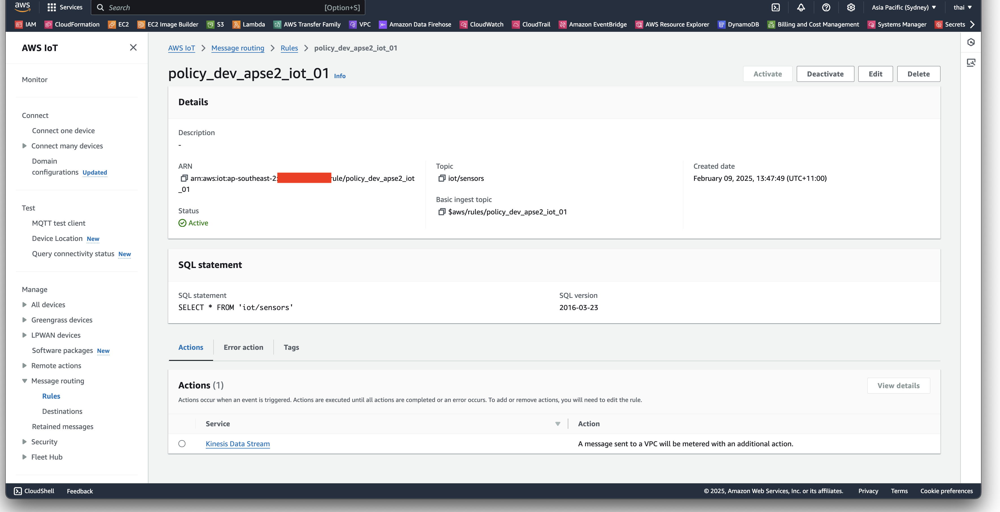

### AWS Kinesis Data Streams

The following screenshot below shows the provisioned Kinesis Data Stream.

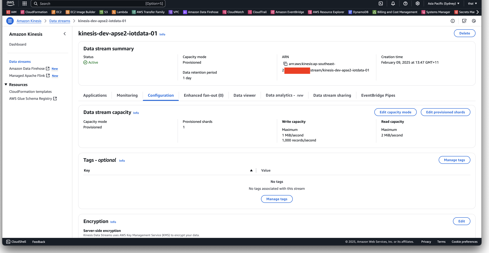
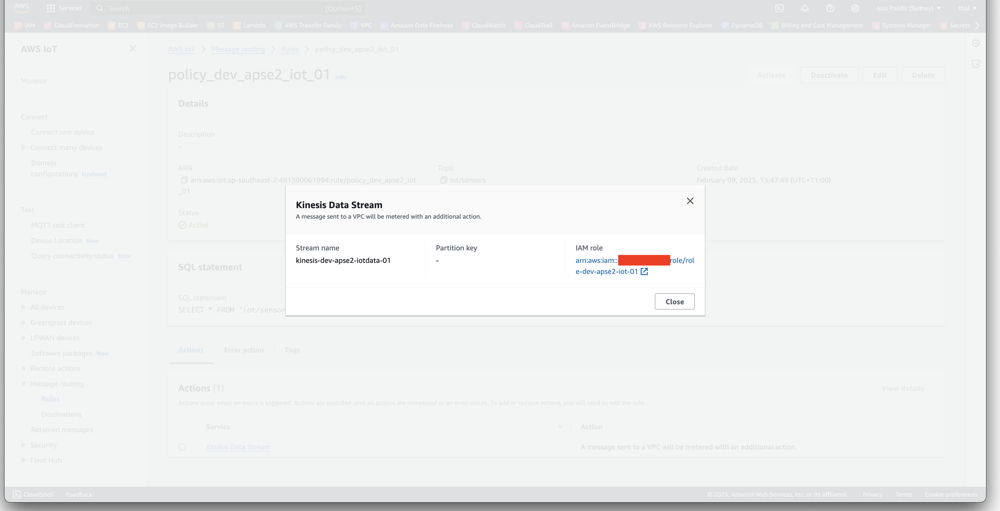

### AWS Lambda

The following screenshot below shows the provisioned Lambda function.

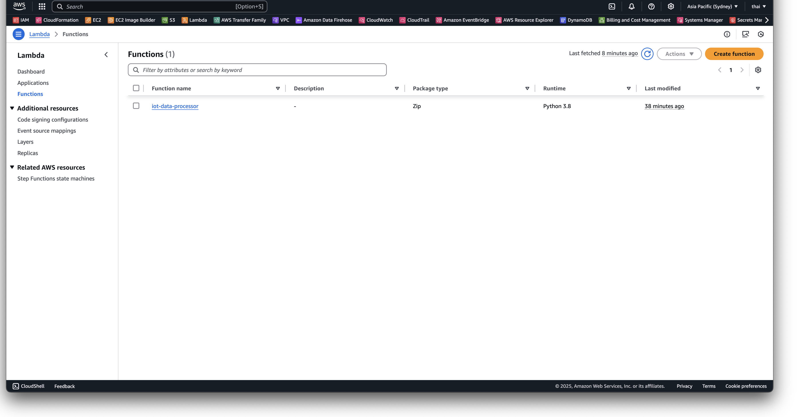
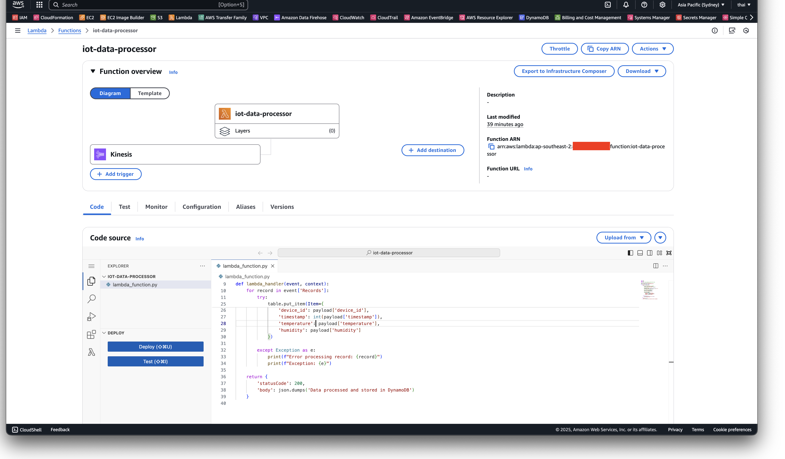
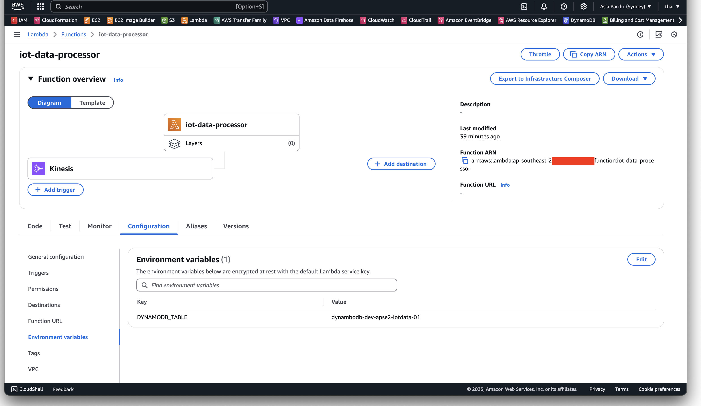

### Amazon DynamoDB

The following screenshot below shows the provisioned DynamoDB table.

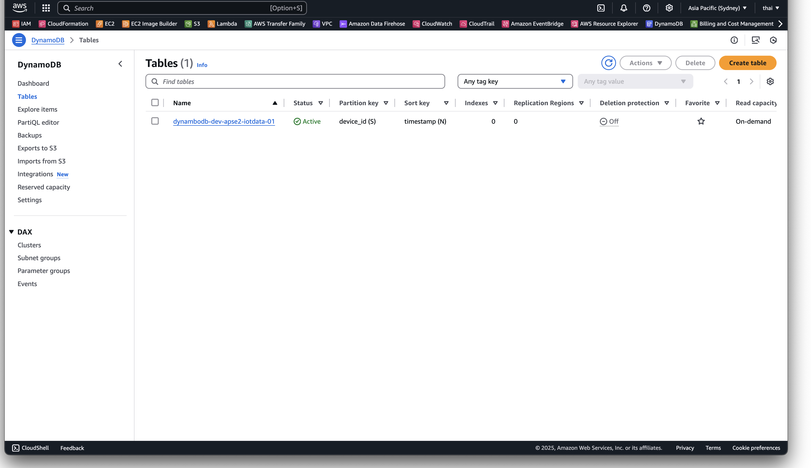
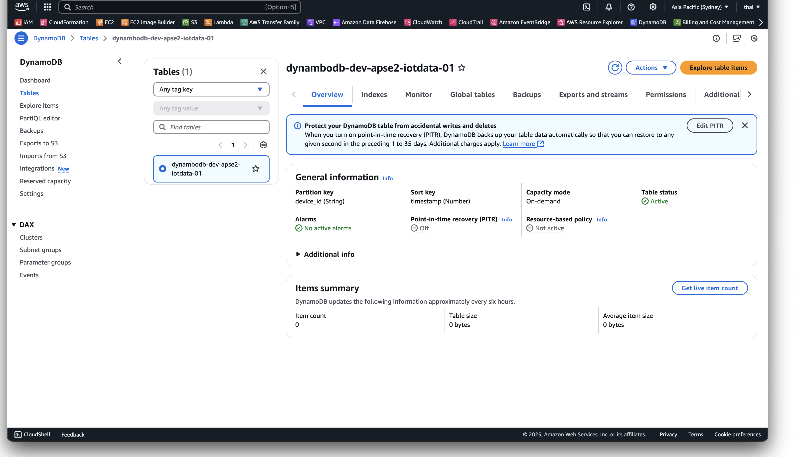
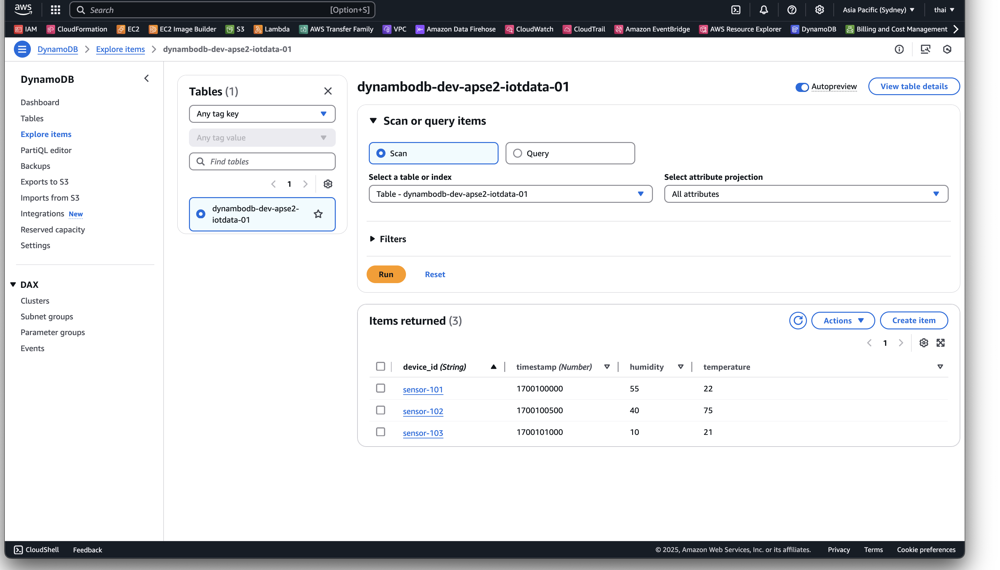
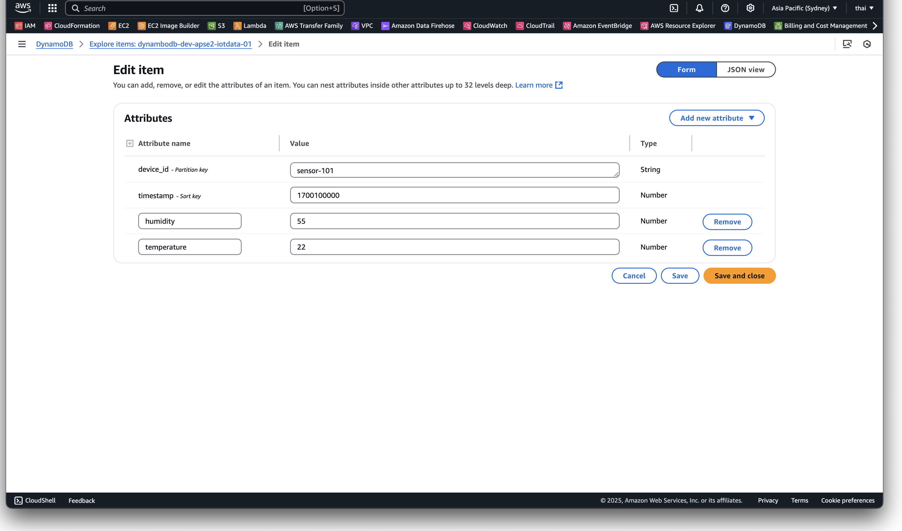

### AWS Glue

The following screenshot below shows the provisioned Glue Crawler and Data Catalog.

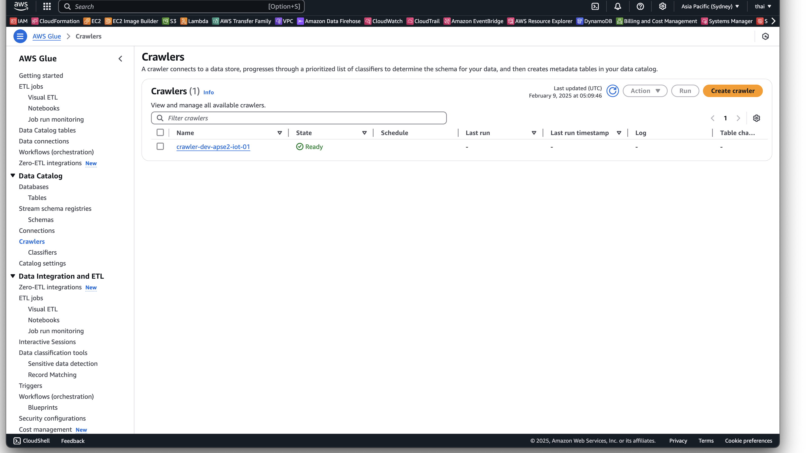
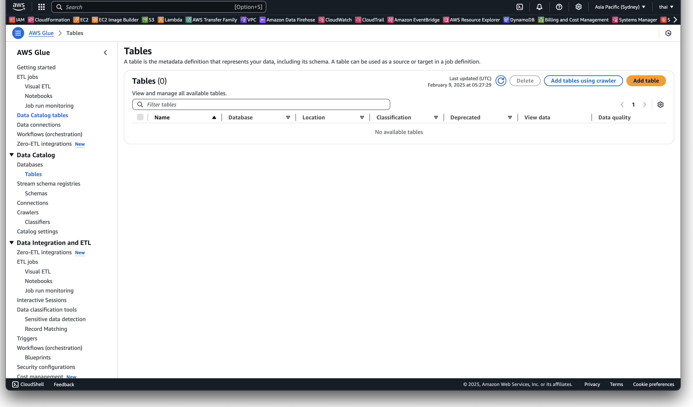
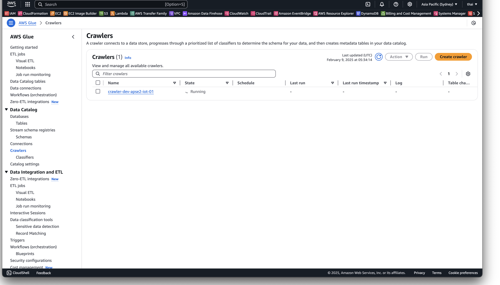
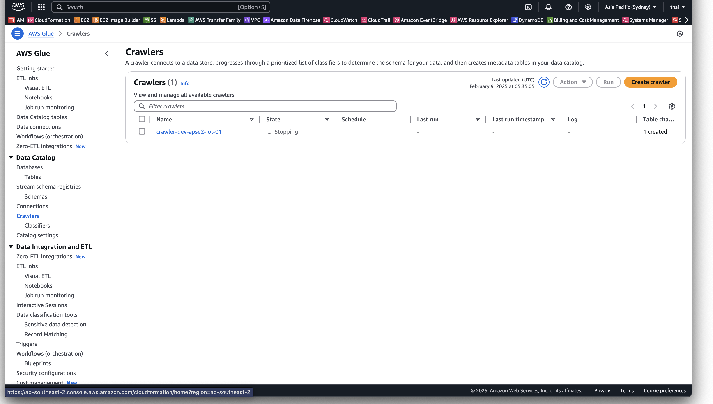
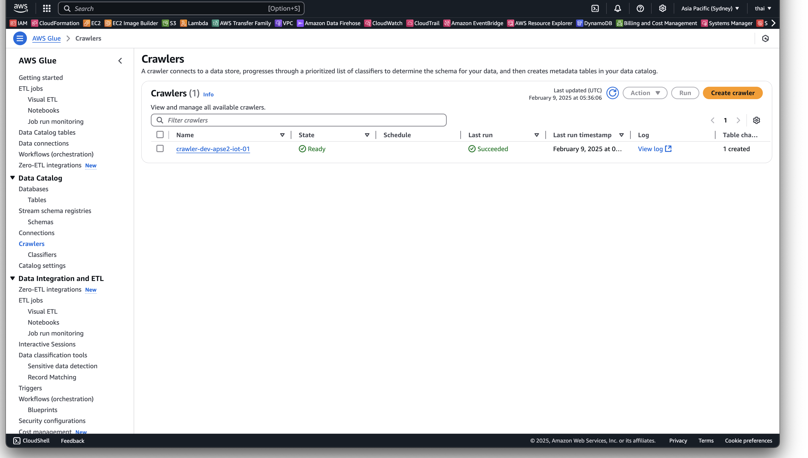
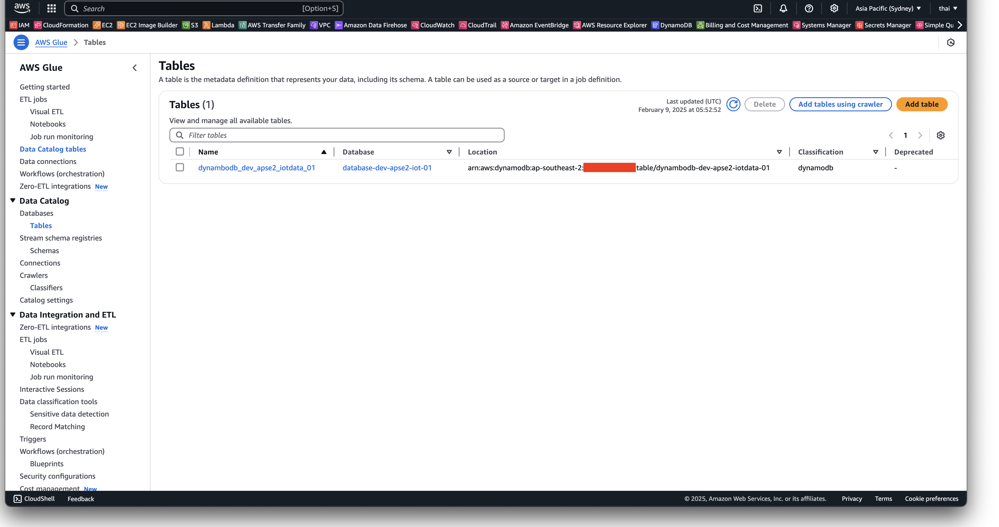
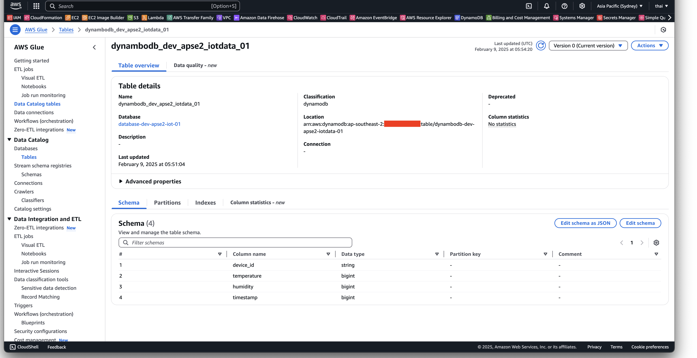

### Amazon Redshift

The following screenshot below shows the provisioned Redshift cluster.

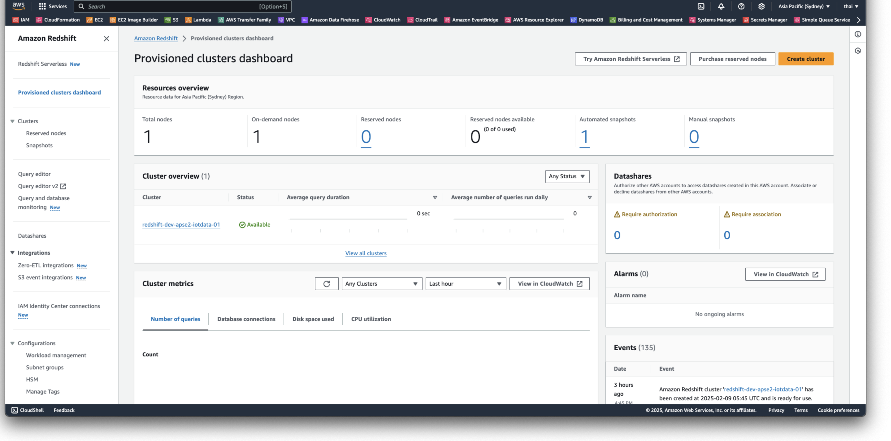
