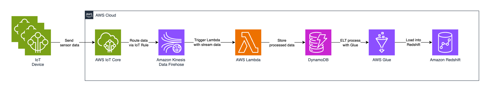

# Amazon Inspector

## Project Overview

This project implements a real-time serverless data pipeline to process IoT sensor data efficiently. IoT devices publish sensor data to AWS IoT Core, which routes it to Kinesis Data Streams. AWS Lambda processes and transforms this data before storing it in DynamoDB for real-time querying. AWS QuickSight visualises this data to provide insights. For deeper analytics, AWS Glue extracts, transforms, and loads (ETL) data into Amazon Redshift.

## Workflow

1. **IoT Devices Send Data:** IoT devices publish real-time sensor data (e.g., temperature, humidity) to AWS IoT Core.
2. **AWS IoT Core Routes Data to Kinesis:** IoT Core rules forward data to Amazon Kinesis Data Streams for real-time ingestion
3. **Kinesis Streams Process Data:** AWS Kinesis holds the incoming data stream, ensuring scalability and real-time processing. It also, triggers Lambda functions to process the data.
4. **AWS Lambda Transforms Data:** A Lambda function fetches data from Kinesis, processes it (e.g., normalises values, removes noise), and stores it in DynamoDB.
5. **AWS DynamoDB Stores Data:** The transformed IoT data is stored in a DynamoDB table for real-time querying.
6. **AWS QuickSight Visualises Data:** QuickSight queries DynamoDB to provide insights into trends and anomalies.
7. **AWS Glue Performs ETL to Amazon Redshift:** Periodically, AWS Glue extracts data from DynamoDB, transforms it, and loads it into Redshift for in-depth analytics.

The following diagram represents the workflow of this project.



## Technologies Used

- **AWS IoT Core:** Securely connects IoT devices to AWS and routes their data to other services.
- **AWS Kinesis Data Streams:** A real-time data streaming service used for ingesting large volumes of sensor data.
- **AWS Lambda:** Processes the streamed data by transforming and filtering it before storage.
- **Amazon DynamoDB:** A NoSQL database for storing the processed IoT data for real-time querying.
- **AWS QuickSight:** Provides visual analytics and dashboards for real-time insights into the IoT data.
- **AWS Glue:** An ETL (Extract, Transform, Load) service that integrates with Amazon Redshift for deeper analytics.
- **Amazon Redshift:** A fully managed data warehouse used for complex queries and large-scale analytics.
- **IAM:** Identity and Access Management for defining roles and permissions.
- **Terraform:** Infrastructure as Code (IaC) tool for automating resource provisioning.
- **Git:** For version control.

## Key Terms

- **IoT Devices:** Physical devices embedded with sensors, software, and connectivity to exchange data with other devices or systems over the internet.
- **AWS IoT Core:** A managed cloud service that allows IoT devices to securely connect and interact with AWS services and other devices. It handles device authentication, data routing, and communication protocols.
- **Kinesis Data Streams:** A real-time data streaming service that enables the continuous capture and processing of large volumes of data from multiple sources. It supports real-time analytics, data transformation, and event-driven applications.
- **AWS Lambda:** A serverless compute service that automatically runs code in response to events, such as data arriving in a Kinesis stream, without the need to manage servers. It scales automatically based on the workload.
- **Amazon DynamoDB:** A fully managed NoSQL database service that offers fast and predictable performance with seamless scalability. It stores the processed data in a key-value format for real-time querying.
- **AWS QuickSight:** A business intelligence service that allows users to create and share interactive dashboards and visualisations from various data sources, including DynamoDB.
- **AWS Glue:** A serverless ETL (Extract, Transform, Load) service that prepares and transforms data for analytics. It can move data from DynamoDB to Redshift for more complex querying.
- **Amazon Redshift:** A fast, scalable data warehouse service designed for large-scale data analysis and complex queries. It integrates with AWS Glue for deep analytical processing.
- **ETL (Extract, Transform, Load):** A process in data integration that involves extracting data from source systems, transforming it into a suitable format, and loading it into a target system for analysis.
- **Serverless Architecture:** A cloud computing execution model where the cloud provider dynamically manages the allocation of machine resources. Services like Lambda and DynamoDB enable applications to scale automatically without infrastructure management.
- **Event Source Mapping:** A mechanism in AWS Lambda that connects event sources like Kinesis streams to Lambda functions, automatically invoking the function when new data arrives.
- **IAM (Identity and Access Management):** A service that helps control access to AWS resources securely by defining roles and permissions for users, applications, and services.

## Key Concepts

**Internet of Things (IoT):**
The Internet of Things refers to the interconnected network of physical devices that collect and exchange data using embedded sensors and software. These devices can range from household gadgets like smart thermostats to industrial machines monitoring production lines. IoT enables real-time data collection and automation, driving efficiencies across industries.

**Real-Time Data Processing:**
Real-time data processing involves capturing, analysing, and acting on data as soon as it is generated. This allows businesses to respond immediately to changes, such as adjusting machine operations in an industrial setting or triggering alerts for unusual sensor readings in smart homes. Real-time processing ensures minimal latency between data generation and action.

**Serverless Computing:**
Serverless computing allows developers to build and run applications without managing the underlying infrastructure. AWS Lambda is a great example, where code execution is event-driven, automatically scaling based on demand. This reduces operational overhead and costs, as billing is based on execution time rather than pre-allocated resources.

**Data Streaming with Kinesis:**
AWS Kinesis Data Streams enables the ingestion and processing of large volumes of data in real-time. It acts as a buffer for incoming data from multiple sources, such as IoT devices, and ensures that the data can be processed or stored without loss. Kinesis supports parallel data processing, allowing multiple consumers like AWS Lambda to handle different aspects of the data stream.

**Data Transformation:**
Data transformation involves converting raw data into a structured format suitable for storage and analysis. In this project, AWS Lambda functions are responsible for transforming IoT sensor data—such as normalising temperature readings or filtering out invalid data—before storing it in DynamoDB.

**NoSQL Databases (DynamoDB):**
NoSQL databases like Amazon DynamoDB are designed to handle unstructured or semi-structured data with high flexibility and scalability. Unlike traditional relational databases, DynamoDB uses a key-value model, which is ideal for handling dynamic IoT data with varying attributes. It offers low-latency access for real-time applications.

**Data Visualisation with QuickSight:**
AWS QuickSight enables the creation of interactive dashboards and visual reports from data stored in services like DynamoDB. Visualisations help identify trends, anomalies, and insights from the IoT data, providing stakeholders with actionable intelligence in an accessible format.

**ETL (Extract, Transform, Load) Pipelines:**
ETL is the process of moving data from a source system, transforming it into a usable format, and loading it into a target system for analysis. In this architecture, AWS Glue performs ETL by extracting data from DynamoDB, transforming it as necessary, and loading it into Amazon Redshift for complex querying and deep analytics.

**Data Warehousing (Amazon Redshift):**
A data warehouse like Amazon Redshift is optimised for querying large datasets and running complex analytical queries. It aggregates processed IoT data from multiple sources, allowing for historical trend analysis, forecasting, and large-scale reporting beyond real-time capabilities.

**Event-Driven Architecture:**
This architecture pattern relies on events to trigger and communicate between services. For example, new IoT data entering a Kinesis stream triggers a Lambda function, which processes the data and stores it in DynamoDB. Event-driven systems are highly scalable, as they can handle a large number of events asynchronously.

## Requirements

- Terraform v1.5+
- AWS CLI
- AWS credentials configured.

## Usage

1. Clone this repository.

### Terraform

1. Edit `terraform.tfvars` with the desired AWS region and other variables.
2. Initialise Terraform:

   ```bash
   terraform init
3. terraform validate:

    ```bash
    terraform validate
    ```

4. Plan and apply the configuration:

    ```bash
    terraform plan
    terraform apply
    ```

### CloudFormation

1. Validate the CloudFormation template:

2. Create the CloudFormation stack:

## Testing

### 1. Basic Functional Tests

#### Test 1: Standard Sensor Data (Normal Range)

```bash
aws iot-data publish \
  --topic "iot/sensors" \
  --payload "$(echo -n '{"device_id": "sensor-101", "timestamp": 1700100000, "temperature": 22, "humidity": 55}' | base64)"
```

#### Test 2: High Temperature Alert

```bash
aws iot-data publish \
  --topic "iot/sensors" \
  --payload "$(echo -n '{"device_id": "sensor-102", "timestamp": 1700100500, "temperature": 75, "humidity": 40}' | base64)"
```

#### Test 3: Low Humidity Alert

```bash
aws iot-data publish \
  --topic "iot/sensors" \
  --payload "$(echo -n '{"device_id": "sensor-103", "timestamp": 1700101000, "temperature": 21, "humidity": 10}' | base64)"
```

### 2. Edge Case Tests

This tests how Lambda handles incomplete data.

#### Test 4: Missing Fields (Humidity Missing)

```bash
aws iot-data publish \
  --topic "iot/sensors" \
  --payload "$(echo -n '{"device_id": "sensor-104", "timestamp": 1700101500, "temperature": 30}' | base64)"
```

#### Test 5: Invalid Data Format

This test sends invalid JSON to ensure error handling is in place.

```bash
aws iot-data publish \
  --topic "iot/sensors" \
  --payload "$(echo -n 'Invalid JSON Data' | base64)"
```

### 3. Out-of-Range Data Test

This tests how the system handles extreme values.

#### Test 6: Extremely High Temperature

```bash
aws iot-data publish \
  --topic "iot/sensors" \
  --payload "$(echo -n '{"device_id": "sensor-105", "timestamp": 1700103000, "temperature": 150, "humidity": 30}' | base64)"

```

#### Test 7: Negative Temperature and Humidity

```bash
aws iot-data publish \
  --topic "iot/sensors" \
  --payload "$(echo -n '{"device_id": "sensor-106", "timestamp": 1700103500, "temperature": -10, "humidity": -5}' | base64)"
```

### 5. Multi-Sensor Complex Data Test

Simulate multiple sensors with varying readings for a more realistic scenario.

```bash
aws iot-data publish \
  --topic "iot/sensors" \
  --payload "$(echo -n '{"device_id": "sensor-107", "timestamp": 1700104000, "temperature": 25, "humidity": 65, "pressure": 1012}' | base64)"

```

### 6. Verify Data in DynamoDB

```bash
aws dynamodb scan --table-name dynambodb-dev-apse2-iotdata-01
```

## Cleanup

### Terraform

1. Destroy resources

    ```bash
    terraform destroy
    ```

### CloudFormation

1. Destroy resources

## Screenshots
