# High Availability Web Application Infrastructure on AWS using Terraform

## Project Overview

This project demonstrates the creation of a highly available infrastructure to host a web application using AWS and Terraform. The setup includes an Amazon VPC, subnets across multiple Availability Zones, an EC2 instance with a web server, and an Application Load Balancer (ALB).

## Status

This project is complete and successfully provisions a highly available web application infrastructure on AWS.

## Technologies Used

- Terraform: Infrastructure as Code (IaC) tool to provision AWS resources.
- AWS: Cloud platform for deploying infrastructure.
- Git: Version control for managing Terraform configuration files.

## Project Features

- Highly Available Infrastructure:
  - VPC with private and public subnets across two Availability Zones.
  - Internet Gateway and route tables for network routing.
- Scalable Web Application:
  - EC2 instances with a web server.
  - Application Load Balancer (ALB) for distributing traffic.
- Secure Configuration:
  - Security groups for controlled access.
  - IAM roles for instance profiles.
- Reusable Terraform Modules:
  - Separate modules for networking, compute, and storage.

## Background

### Terraform

Terraform is an open-source IaC tool that allows users to define and provision infrastructure in a declarative configuration language. By using modules, Terraform configurations become reusable and maintainable.

### IAM Roles

IAM roles in AWS are a way to grant temporary permissions to entities like AWS services, users, or applications to perform specific actions on your behalf.

### Amazon VPC (Virtual Private Cloud)

Amazon VPC is a logically isolated section of AWS where users can define and control the networking setup, including subnets, route tables, and gateways. This ensures secure communication and segmentation of resources. In this project, the VPC provides the foundational network for hosting the web application.

### Subnets and Availability Zones (AZs)

Subnets are subdivisions of the VPC, enabling segregation of resources into public and private networks. Resources in public subnets are accessible from the internet, while private subnets are not directly exposed. Using multiple AZs ensures high availability by preventing single points of failure due to zone outages.

### Internet Gateway and Route Tables

The Internet Gateway enables outbound internet access for resources in public subnets. Route tables define how traffic is routed within the VPC, linking subnets to the gateway for external communication.

### EC2 Instances

Amazon Elastic Compute Cloud (EC2) instances are virtual servers running the web application. These instances are configured with a web server (e.g., Apache) to serve HTTP requests.

### Application Load Balancer (ALB)

ALBs distribute incoming traffic across multiple EC2 instances, ensuring reliability, scalability, and fault tolerance. ALBs automatically detect and bypass unhealthy instances to provide uninterrupted service.

### Security Groups

Security groups act as virtual firewalls, controlling inbound and outbound traffic to AWS resources. In this project, they ensure only authorised access to EC2 instances and ALBs.

## Workflow

1. **Network Setup:**

    - A VPC is created with public subnets spanning two Availability Zones to ensure fault tolerance and high availability.
    - An Internet Gateway is attached to the VPC to enable internet access for resources in the public subnets.
    - Route tables are configured to manage traffic routing between subnets and the Internet Gateway.

2. **Compute Setup:**
    - EC2 instances are provisioned in public subnets to host the web application.
    - Security groups are assigned to EC2 instances to restrict inbound traffic, allowing only necessary ports such as HTTP (port 80) and SSH (port 22) for secure access.

3. **Load Balancer Setup:**
    - An Application Load Balancer is created in public subnets to handle incoming traffic.
    - The ALB is linked to a target group containing the EC2 instances, distributing incoming requests evenly and monitoring their health.

4. **Secure Configuration:**
    - IAM roles are created to allow EC2 instances to interact with other AWS services securely.
    - Security groups are assigned to the ALB and EC2 instances to define and enforce access rules.

5. **Reusable Configuration:**
    - Terraform modules are used for network, compute, and storage configuration. This promotes consistency and makes the setup scalable and easy to replicate.

6. **Deployment Workflow:**
    - Terraform scripts are initialised, validated, and applied to provision the infrastructure.
    - Once the infrastructure is live, the web application is deployed on the EC2 instances.

7. **Testing and Validation:**
    - ALB health checks ensure the EC2 instances are responsive.
    - Various curl commands are used to test accessibility from within and outside the AWS environment.

8. **Monitoring and Maintenance:**
    - AWS Management Console and Terraform outputs are used to monitor and troubleshoot the deployed resources.

## Requirements

- Terraform v1.5+
- AWS CLI
- AWS credentials configured.

## Usage

1. Clone this repository.
2. Edit `terraform.tfvars` with your AWS region and other variables.
3. Initialize Terraform:

   ```bash
   terraform init
4. terraform validate:

    ```bash
    terraform validate
    ```

5. Plan and apply the configuration:

    ```bash
    terraform plan
    terraform apply
    ```

## Testing

| Step          | Command/Action | Expected Output  |
| ------------- | -------------- | -----------------|
| Verify ALB Health Status       | 1. Go to AWS Management Console. <br>2. Navigate to EC2 > Load Balancers. <br>3. Select ALB (`alb-dev-apse2-01`). <br>4. Check the Resource Map for registered target's health status. | Registered targets should be Healthy.
| Check Web Server Status        | Run the following on the EC2 instance: <pre> <p>sudo systemctl status httpd </p></pre>        |   Web server should be Active (running).
| Test the Website Locally       | Run the following on the EC2 instance: <pre> <p>curl http://localhost </p></pre>              |   `Welcome to Terraform Web App!`
| Test Public IP from EC2        | Run the following on the EC2 instance: <pre> <p>curl http://&lt;Public-IP&gt;</p></pre>       |   `Welcome to Terraform Web App!`
| Test ALB DNS Name from EC2     | Run the following on the EC2 instance: <pre> <p>curl http://&lt;ALB-DNS-Name&gt;</p></pre>    |   `Welcome to Terraform Web App!`
| Test Public IP from External   | Run the following on an external machine: <pre> <p>curl http://&lt;Public-IP&gt;</p></pre>    |   `Welcome to Terraform Web App!`
| Test ALB DNS Name from EC2     | Run the following on an external machine: <pre> <p>curl http://&lt;ALB-DNS-Name&gt;</p></pre> |   `Welcome to Terraform Web App!`

## Cleanup

Destroy resources

  ```bash
  terraform destroy
  ```

## Screenshots

### IAM Role

The following screenshot below shows the provisioned IAM role and policy.

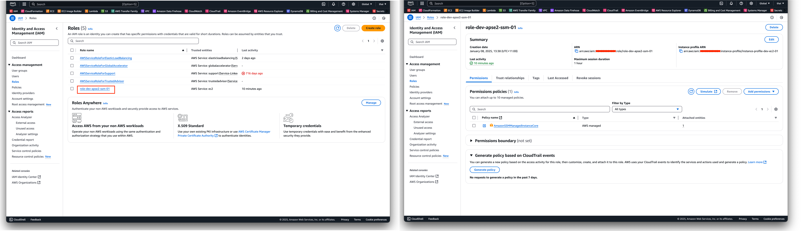

### VPC

The following screenshot below shows the provisioned VPC and its Security Group

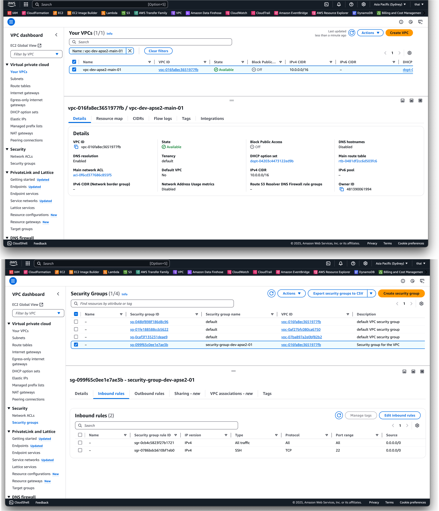
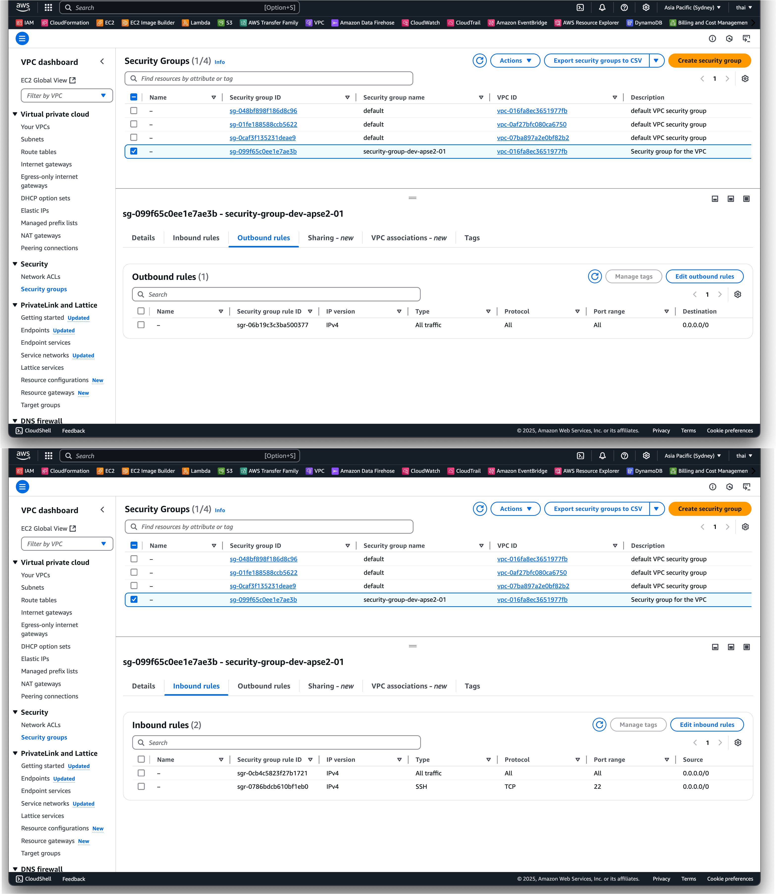

### EC2

The following screenshots below shows the provisioned EC2 and a test case of the website.

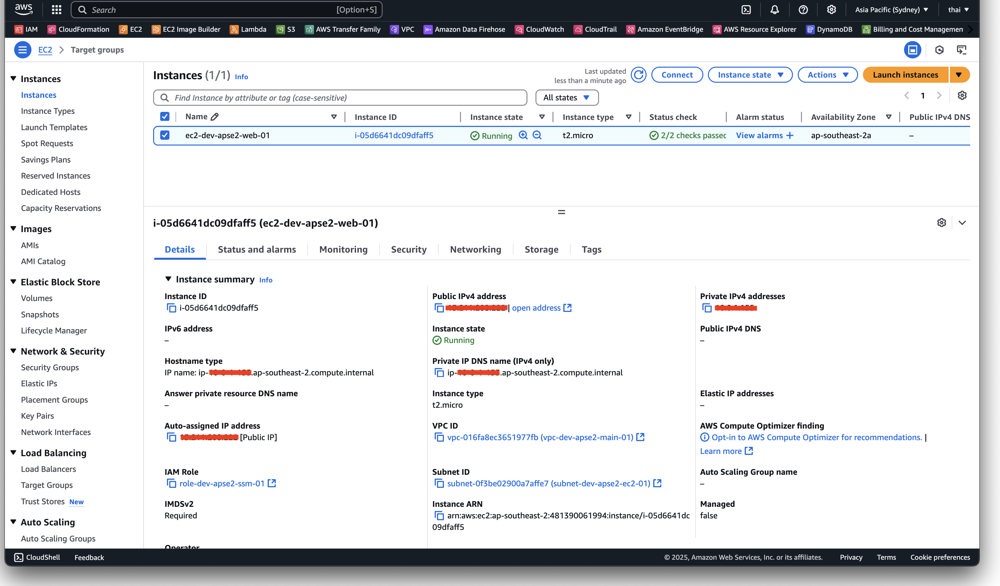
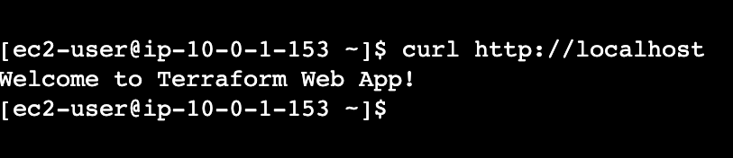

### Application Load Balancer

The following screenshots below shows the provisioned Application Load Balancer.

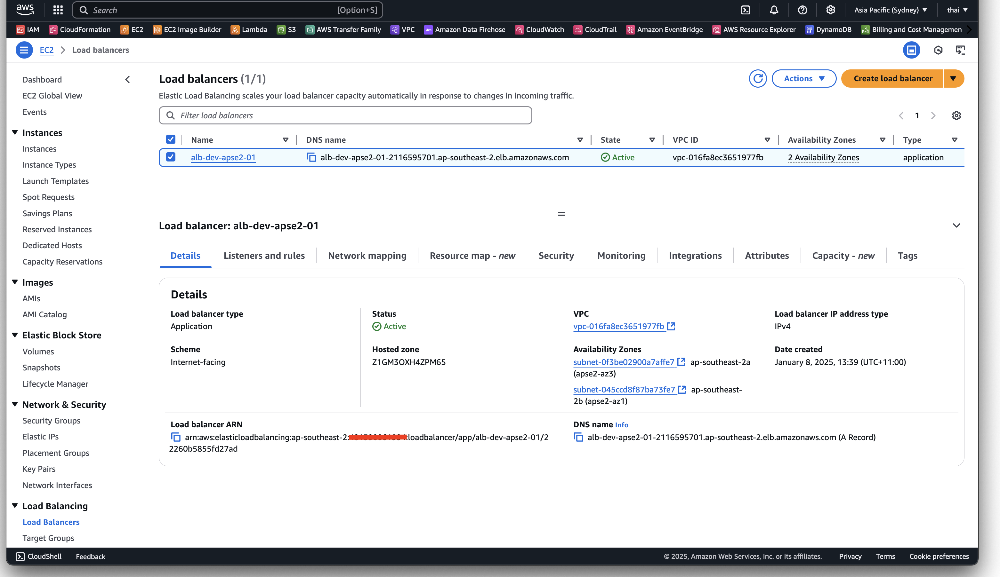
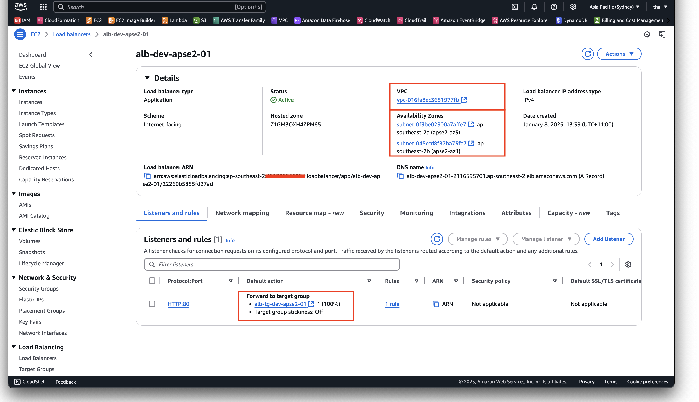
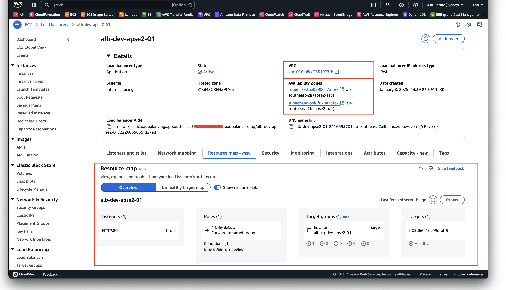

The following screenshots below shows the provisioned Application Load Balancer's Target Group.
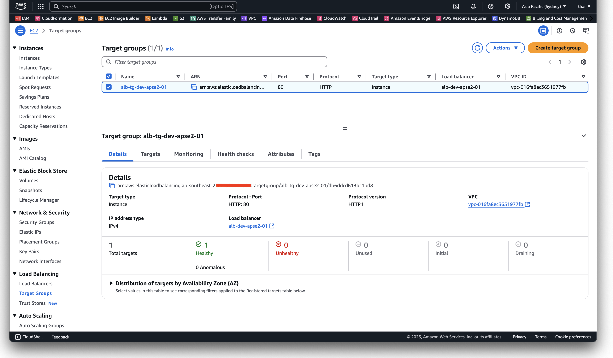
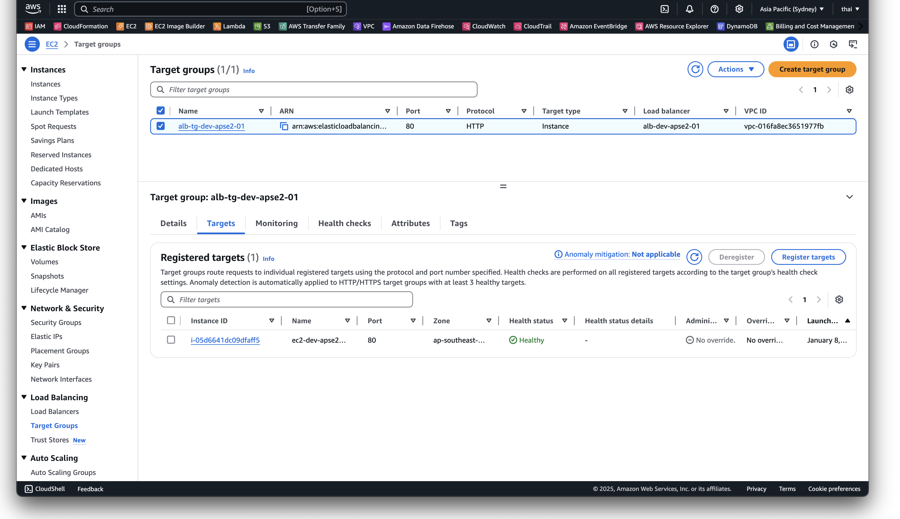
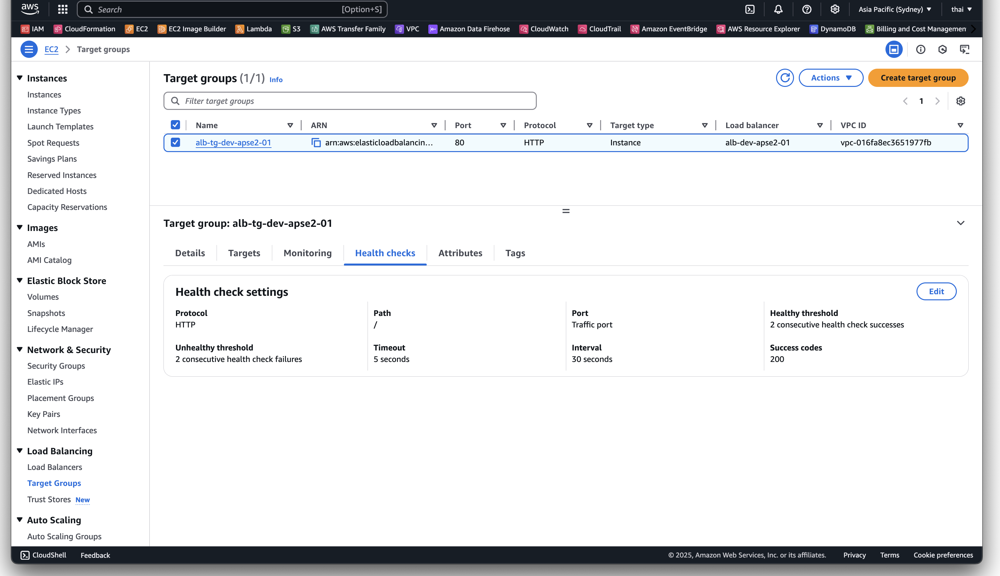